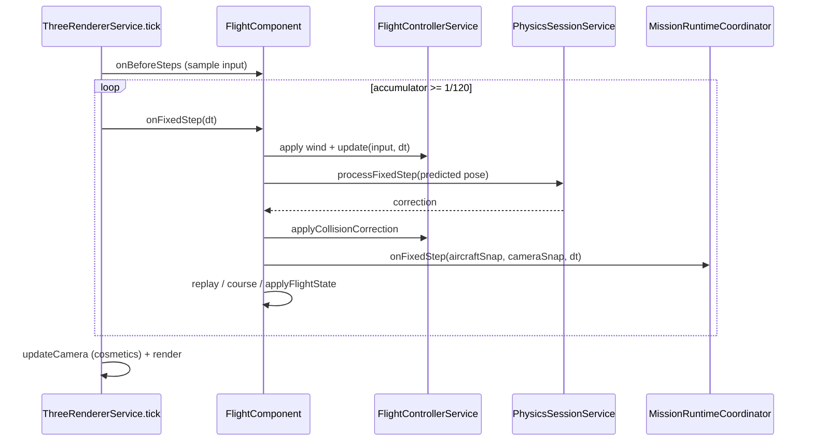

# FPV Simulator v1.3.0 — Checkpoint 1 Repository Audit

**Milestone:** Curated Location and Photography Mission  
**Audit date:** 2026-07-26  
**Official baseline:** Release `v1.2.0 — Playable Drone Builder`  
**Baseline commit:** `fdf17b94643ef53e068291066e7faae67bcfb37f`  
**Tag:** `v1.2.0` (annotated tag; peeled commit matches baseline)

This checkpoint is inspection and architecture alignment only. No mission domain, photography scoring, location packages, or mission UI were implemented.

---

## 1. Executive audit summary

The repository at `main` / `fdf17b9` is a viable foundation for v1.3.0. The flight authority model is already correct: one `FlightControllerService`, one RAF-owned fixed-timestep accumulator in `ThreeRendererService`, Rapier as post-integration collision infrastructure, and a single flyable contract (`AircraftDefinition`) for factory and compiled aircraft.

v1.3.0 can integrate without a second flight loop. The safest mission fixed-step hook is inside the existing `onFixedStep` callback in `FlightComponent`, **after** collision correction and **before** frame-only presentation work.

Three findings require explicit alignment before domain implementation:

1. **Camera authority gap:** `AircraftDefinition.cameraProfile.fpv` declares `localPosition`, `cameraAngleDeg`, and `defaultFov`, but live FPV rendering hardcodes mount `(0, 0.12, -0.18)`, hardcodes FOV `75`, and only applies tilt via `AppliedFlightConfig.fpvCameraTilt`. Cosmetic effects further mutate the visible camera on the frame path.
2. **God-object coupling:** `FlightComponent` (~3475 LOC) and `ThreeRendererService` (~2552 LOC) already own too many concerns. Mission logic must not be appended directly into either.
3. **Environment model is procedural-parameter oriented.** Coastal Ruins already sketches Mediterranean motifs procedurally, but curated location packages need a parallel authored domain that adapts into the existing generator/renderer/physics pipeline — not a forced rewrite of trainer environments.

**Recommendation:** proceed to Checkpoint 2 with contracts, ports, coordinators, and thin adapters only. Do not implement scoring, capture UI, or final location content yet.

---

## 2. Baseline verification

| Check | Result |
|---|---|
| Working tree HEAD | `fdf17b94643ef53e068291066e7faae67bcfb37f` |
| Branch | `main` (no feature branch created) |
| Tag `v1.2.0` peeled commit | `fdf17b94643ef53e068291066e7faae67bcfb37f` |
| Release message | Merge PR #5 — playable drone builder |
| Dirty status at audit start | Clean |
| Upstream remote | `https://github.com/AmjadGn/fpv-trainer.git` |
| Origin remote | `https://github.com/gneemamjad/fpv-trainer.git` |
| Package version field | `1.0.0-alpha.1` in `package.json` (marketing release is tag `v1.2.0`) |

Note: `git rev-parse v1.2.0` without peel returns the annotated tag object hash; `v1.2.0^{}` peels to the release commit above.

Documented historical baselines (`docs/architecture/baseline-v1.1.2.md`) cited older counts (engineering 39 / Angular 325). Current executed counts are higher (see §15 / Validation).

---

## 3. Current application lifecycle

### Navigation architecture

Hybrid shell + router:

- **Trainer SPA shell** is signal-driven via `AppShellService` (`src/app/core/shell/app-shell.service.ts`). Views include `home`, `fly`, `hangar`, `builder`, `academy`, `courses`, `environments`, `flight`, etc.
- **Angular routes** (`src/app/app.routes.ts`) cover landing (`/`), thin `/app` host, Hangar deep-link, auth, competitive/online pages (`/compete`, `/season`, `/leaderboards`, …).
- Root `App` (`src/app/app.ts` + `app.html`) switches shell views when not on an “online” route. Flight is a shell view, not a dedicated route.

`ShellHostComponent` is intentionally empty — the real shell lives in `App`.

### Launch-context lifecycle

```text
Hub / Hangar / Builder / Academy / Courses
  → AppShellService.showFlight(FlightLaunchIntent)
  → shell.view = 'flight'; shell.flightIntent set
  → FlightComponent mounts / detects view
  → consumeFlightIntent() / applyLaunchIntent()
  → pending intent handled after environment mount
```

Current `FlightLaunchIntent` kinds (`app-shell.service.ts`):

- `free`
- `race` (course + optional ranked session)
- `training`
- `replay`
- `test-flight` (exact aircraft id from Builder/Hangar)

### Where `MissionLaunchIntent` should live

Extend `FlightLaunchIntent` in `AppShellService` (same file / adjacent model module), e.g.:

```text
| { kind: 'mission'; missionId: string; locationId: string; aircraftId?: string }
```

Do **not** invent a second navigation bus. Mission briefing / results screens should be new `AppView` values (or a nested mission phase owned by a facade), keeping flight itself on `view: 'flight'`.

### Mission screen representation (recommendation)

| Phase | Representation |
|---|---|
| Mission select / briefing | Shell view(s), e.g. `missions` / `mission-briefing` |
| Loading | Shell overlay or flight loading path already used by `FlightComponent` |
| Flight | Existing `flight` view + mission intent |
| Results | Shell view `mission-results` (keeps score UI out of `FlightComponent`) |

**Hybrid is correct:** keep mission product surfaces in the shell; keep competitive/account surfaces on routes. Safest integration point: extend `FlightLaunchIntent` + add shell views — no App shell rewrite.

Existing `MissionApiService` (`src/app/core/missions/services/mission-api.service.ts`) is an HTTP stub for **season/competitive** backend missions — unrelated to photography missions. Do not overload it.

---

## 4. Exact flight fixed-step order

### Ownership

| Concern | Owner |
|---|---|
| `requestAnimationFrame` | `ThreeRendererService.tick` only |
| Fixed-step accumulator | `ThreeRendererService` (`physicsStep = 1/120`) |
| Flight integration | `FlightControllerService.update` |
| Rapier step + contacts | `PhysicsSessionService` → `DroneCollisionService` |
| Orchestration glue | `FlightComponent` mount callbacks |

### Ordered sequence — one live frame with N fixed steps

From `ThreeRendererService.tick` (`three-renderer.service.ts`):

1. **RAF tick** — schedule next frame; bail if `document.hidden` (accumulator cleared).
2. Clamp frame delta to `FLIGHT_CONFIG.maxFrameDelta`.
3. **`onBeforeSteps`** (once per frame) — `FlightComponent` samples merged stick input into `frameInput` (skipped in replay).
4. **While accumulator ≥ physicsStep** — call `onFixedStep(step)`:

Inside `FlightComponent` `onFixedStep` (approx. lines 1999–2128):

| # | Step | Notes |
|---|---|---|
| 4.1 | Pause / environment-ready gate | Early return if paused or env not ready |
| 4.2 | `applyWindToFlight(fixedDt)` | Weather → `FlightControllerService` wind sample |
| 4.3 | Capture `before` position | For course/training segment tests |
| 4.4 | `flight.update(frameInput, fixedDt)` | Authoritative integration (+ legacy ground if enabled) |
| 4.5 | `physicsSession.processFixedStep(...)` | Sync kinematic drone → `world.step()` → shape/intersection queries → correction |
| 4.6 | `flight.applyCollisionCorrection(...)` | Final pose/velocity/crash for this step |
| 4.7 | `flight.recordPostPhysicsVelocity(...)` | Ledger bookkeeping |
| 4.8 | Damage visual stamp | Render-only |
| 4.9 | Course / training fixed updates | `courseRun.update` / `updateTrainingFixedStep` |
| 4.10 | Achievement takeoff hook | Side effect |
| 4.11 | `replayRecorder.pushSample(...)` | Subsamples at 30 Hz from fixed-step clock |
| 4.12 | `renderer.applyFlightState({ position, orientation })` | Syncs drone mesh pose |
| 4.13 | Crash audio / scrape idle | Side effects |

5. **Frame-only (after all fixed steps):** environment anims, weather particles, **`updateCamera(frameDelta)`**, `onFrame` (HUD, weather update in free mode, ghost, integrity), then `renderer.render`.

### Safest mission insertion point

```text
… applyCollisionCorrection (final corrected aircraft state)
→ build MissionAircraftSnapshot
→ resolve FlightCameraSnapshot (canonical rig, no cosmetic effects)
→ missionRuntime.onFixedStep(aircraftSnap, cameraSnap, fixedDt)
→ replay sample / course updates (or after mission if mission emits discrete events)
→ renderer.applyFlightState
```

**Requirement satisfied:** mission must observe post-correction state, not pre-Rapier prediction.

**Do not** hook mission into `updateCamera` / `onFrame` for scoring authority — those paths include look-lag, shake, FOV offsets, and variable aspect ratio.

---

## 5. Authoritative aircraft-state source

### Current APIs

`FlightControllerService` exposes Angular signals / computeds:

- `armed`, `crashed`, `crashReason`
- `position`, `velocity`, `orientation`, `angularVelocity`
- `altitude`, `speed`, `flightTime`
- `getSimulationTime()` — float seconds while armed
- `getAppliedAircraftId()`, `getCollisionEnergyMultiplier()`
- diagnostics / force ledger (dev / tests)

Model type `FlightStateSnapshot` exists in `flight-state.model.ts` but **is not assembled by a service method** today.

### Missing for mission contracts

| Field | Status |
|---|---|
| Integer simulation tick | **Absent** — only float `getSimulationTime()` |
| Aircraft source type (factory vs user-build) | On `AircraftDefinition.tags` / catalog, not on flight snapshot |
| Runtime compatibility metadata | On compiled artifacts / definition versions, not per-step |
| Immutable DTO without signals | **Required** — mission domain must not import Angular signals or `FlightControllerService` |

### Proposed `MissionAircraftSnapshot` (Checkpoint 2 contract)

```text
simulationTick: number          // floor(simTime / physicsStep) or explicit counter
elapsedSimulationTicks: number
pose: { position: Vec3; orientation: Quat }
linearVelocity: Vec3
bodyAngularVelocity: { pitch, yaw, roll }
armed: boolean
crashed: boolean
crashReason?: string
flightTimeSeconds: number
aircraftId: string
aircraftSource: 'factory' | 'user-compiled'
definitionVersion: string
physicsProfileVersion: string
colliderVersion: string
```

Adapter lives in application layer (e.g. `MissionAircraftSnapshotAdapter`), reading plain values after correction — never signals inside domain packages.

---

## 6. Camera architecture findings

| Piece | Location | Role |
|---|---|---|
| `CameraProfile` / `FpvCameraProfile` | `aircraft/models/camera-profile.model.ts` | Authored per-aircraft intent |
| Shared profiles | `aircraft/data/shared-profiles.ts` | Concrete mount/FOV/angle values |
| `flightProfileToAppliedConfig` | `flight-profile.adapter.ts` | Maps **only** `cameraAngleDeg` → `fpvCameraTilt`; chase offset/lag |
| `ThreeRendererService.updateCamera` | renderer | Live FPV/chase/orbit/replay presentation |
| `FlightCameraEffectsService` | `flight-feedback/` | Cosmetic shake, look lag, FOV offset |
| `flight-frame-sync.ts` | pure helpers | Documents intended FPV look math; default offset `(0, 0.12, -0.18)` |
| Resize | `ThreeRendererService.resize` | Sets `camera.aspect = width/height` from host |

Camera effects are applied on the **frame** path via `FlightComponent` → `renderer.setCameraEffectsState(...)`, then consumed inside `updateCamera`.

---

## 7. Camera-profile versus renderer mismatch analysis

### Declared profile (`FpvCameraProfile`)

- `localPosition`
- `cameraAngleDeg`
- `defaultFov` / min / max
- vibration / noise / visibility flags

### Actually used in live FPV

| Field | Used? | Evidence |
|---|---|---|
| `cameraAngleDeg` | **Yes** (via rad tilt) | `flightProfileToAppliedConfig` → `cfg.fpvCameraTilt` → `updateCamera` |
| `localPosition` | **No** | `updateCamera` hardcodes `scratchOffset.set(0, 0.12, -0.18)` |
| `defaultFov` | **No** | Mount sets `baseFov = 75`; `FlightComponent` passes `baseFov: 75` into effects |
| Chase `localOffset` / `followLag` | **Yes** | Via `AppliedFlightConfig` |
| Vibration / noise profile fields | Indirect / settings-driven effects, not profile-faithful | `FlightCameraEffectsService` |

### Cosmetics that must be excluded from authoritative photo scoring

- `fovOffsetDegrees`
- `lookLagPitch` / `lookLagYaw` / `lookLagRoll`
- `positionOffset` (impact shake)
- Chase smoothing / orbit mode
- Device pixel ratio and transient canvas aspect (scoring needs a **fixed canonical aspect**, e.g. 16:9)

### Timing

- Authoritative aircraft pose: end of fixed step.
- Visible Three.js camera: **after** all fixed steps in the same frame (`updateCamera`).
- Mission fixed-step camera snapshot must be derived from **pose + ResolvedFlightCameraRig**, not from `PerspectiveCamera` after effects.

### Proposed responsibilities

| Type | Responsibility |
|---|---|
| `ResolvedFlightCameraRig` | Pure: mount local position, tilt rad, base FOV, scoring aspect, body→world transform helpers. Built from `CameraProfile` (+ optional pilot angle override from prefs). |
| `FlightCameraSnapshotPort` | Application port producing immutable world pose/FOV snapshot for a given aircraft pose + rig. Used by mission domain. |
| `ThreeCameraViewAdapter` | Maps rig + optional cosmetic layer onto Three.js `PerspectiveCamera`. Presentation only. |

`docs/aircraft-cameras.md` currently overstates that mount/FOV are applied via `applyAircraft`. Treat that doc as stale relative to code.

---

## 8. Factory and compiled aircraft common runtime path

```text
Compile / catalog registration
  factory: compileAllFactoryAircraft → COMMERCIAL_AIRCRAFT_DEFINITIONS
  user:    compileAircraft → createAircraftDefinitionFromCompilation
           → AircraftCatalogService.registerCompiledAircraft
→ SelectedAircraftService.select | trySelectExact
→ AppShellService.showFlight({ aircraftId, kind })
→ FlightComponent.applySelectedAircraft
→ AircraftRuntimeService.prepareForFlight
     validateAircraftDefinition
     flightProfileToAppliedConfig
→ FlightControllerService.applyAircraftConfig(applied)
→ ThreeRendererService.applyAircraft(definition, { liveryId, appliedConfig })
→ PhysicsSession uses definition.collisionProfile
```

Upstream sources differ; **post-catalog flight entry is identical.** Confirmed: missions can constrain on one resolved `AircraftDefinition`.

### Mission-usable fields (present)

- `category`, dimensions, masses, `thrustToWeightRatio`
- `maximumForwardSpeed` / climb / descent
- `cameraProfile`, `collisionProfile`
- `definitionVersion`, `physicsProfileVersion`, `colliderVersion`
- `recommendedEnvironments`, `recommendedModes`, `recommendedSkillLevel`
- `batteryCapacityMah`, cell count, voltage (raw electrical inputs)

### Untrusted / deferred

| Field | Verdict |
|---|---|
| Endurance / flight minutes | `flightDurationMinutesMin/Max` exist on `CompiledAircraftSpecification.performance` (via `calculatePerformanceMetrics`) and builder UI mapping only — **not copied** onto flyable `AircraftDefinition`. No flight-path battery drain consumer. **Defer** mission endurance gates or mark **estimated**. |
| Compiled camera/collision fidelity | User builds **clone template** camera/collision packs (`compiled-aircraft-definition.factory.ts`) — not build-specific optics/colliders. |
| Hangar restore compatibility | `fingerprintRuntimeCompatibility` / `RuntimeCompatibilitySignature` can mark cached compiled artifacts non-flyable until recompile (`HangarLibraryService.restoreRecords`). |
| Exact vs fallback select | Compiled Hangar fly uses `trySelectExact` (no silent default). Factory Hangar fly uses normal `select()` (may fall back to `DEFAULT_AIRCRAFT_ID`). |
| `MissionApiService` | Competitive HTTP only — ignore for photography missions. |

---

## 9. Existing environment architecture

### Layers

| Layer | Type | Key types / services |
|---|---|---|
| Menu / compatibility metadata | Authored registry | `EnvironmentMetadata`, `EnvironmentRegistryService` |
| Procedural parameter sheet | Authored config | `EnvironmentDefinition` (seed, terrain knobs, sun/fog, vegetation/prop counts, spawn) |
| Generated runtime world | Procedural output | `GeneratedEnvironment` (heights, placements, theme scenery) |
| Renderer construction | Renderer-specific | `ThreeRendererService` terrain/scenery/lights |
| Physics colliders | Physics-specific | `EnvironmentColliderBuilderService` → Rapier bodies |
| User settings | Runtime prefs | quality, ToD, vegetation/shadows/fog toggles |

Registered environments today: Alpine Training Valley, Desert Industrial Yard, **Coastal Ruins** (already has arches/lighthouse/ocean procedural scenery).

### What to reuse vs leave legacy

**Reuse:** registry pattern, quality profiles, load progress stages, spawn pose, fog/sun settings shape, collider manifest pipeline, fallback flat world, rebuild-without-new-RAF.

**Keep as trainer-legacy:** pure procedural heightfield generation as the *only* content path; theme branches hardcoded inside renderer (`buildCoastalScenery`, etc.).

`EnvironmentLoaderService` exists but is **not** the live flight load path — mount progress is driven by renderer callbacks.

Additional verified details:

- `FALLBACK_ENVIRONMENT_ID` is declared in registry models but **not** registered in the `ENVIRONMENTS` array; live fallback is generator `buildFallback()` (`definitionId: 'fallback-flat'`), not a registry entry.
- Default Rapier collider manifest does **not** consume the procedural heightfield as ground (`buildTerrainCollider` exists but is outside the default path); hybrid flight still relies on legacy ground / structure colliders from placements + course gates.

---

## 10. Recommended curated-location integration strategy

**Strategy 4 — limited hybrid (confirmed against code).**

1. Keep current procedural trainer environments operational unchanged for free flight / courses / academy.
2. Introduce versioned **`LocationPackage`** domain (pure): authored spatial metadata, subjects, zones, mission anchors, asset manifests — **no** dependency on `GeneratedEnvironment` or Three.js.
3. Add application adapters:
   - `LocationToEnvironmentAdapter` → produces something the existing mount/physics path can consume (initially may synthesize a compatible `EnvironmentDefinition` + collider overrides / scene addendum).
   - Later: `ThreeLocationSceneAdapter` for curated meshes.
4. Optional thin app-level `EnvironmentOrLocationRuntime` facade for menus (“Trainer Environments” vs “Expedition Locations”) without forcing one model.

**Reject** extending `EnvironmentDefinition` alone as the long-term home for curated Mediterranean Expedition content — it is a procedural parameter sheet, not an authored location package.

Coastal Ruins remains a useful **visual prototype** and collision theme reference, not the production location package.

---

## 11. Three.js responsibility map

`ThreeRendererService` currently owns:

- WebGLRenderer lifecycle + canvas
- **Sole RAF loop** + fixed-step accumulation
- Scene graph, terrain, vegetation, props, theme scenery
- Lighting, fog, sky
- Weather particle attachment
- Aircraft visual build/swap + damage materials
- Camera modes (FPV/chase/orbit/replay)
- Ghost attachment
- Course gate visuals / training overlays (partial)
- Particle pools / trails
- Disposal / rebuildEnvironment

### Must not expand further with

- Mission state machines / scoring
- Photography projection math
- Location package parsing
- IndexedDB mission persistence
- Rapier world ownership

### Proposed extractions adapters (mission-driven, not aesthetic)

| Adapter | Initial approach | Why |
|---|---|---|
| `ThreeLocationSceneAdapter` | New; may delegate mesh add/remove to renderer helpers | Curated assets must not grow theme `if (coastal)` forever |
| `ThreeFlightCameraViewAdapter` | Thin wrapper over `updateCamera` + rig | Needed for canonical vs cosmetic split |
| `ThreeMissionOverlayAdapter` | Delegate initially | Framing/subject helpers; keep out of flight HUD soup |
| `ThreeScreenshotCaptureAdapter` | New focused extraction | No capture API today; share cards use canvas 2D, not WebGL readback |

Screenshot capture does **not** exist on the WebGL path today (`preserveDrawingBuffer` not configured for scoring). Pixel screenshot scoring remains prohibited; any future capture is evidence/UX only.

---

## 12. Rapier responsibility and spatial-query plan

### Current role (confirmed)

Hybrid model documented in `PhysicsSessionService`:

1. Custom flight integrates thrust/torque/wind.
2. Session syncs kinematic drone → steps Rapier → resolves contacts.
3. Corrections return to `FlightControllerService.applyCollisionCorrection`.

`PhysicsWorldService` exposes world/body registration, step, pause, telemetry, and **`getWorld()` / `getRapier()`** (leaks Rapier types to callers). No public `castRay` / LOS API.

`DroneCollisionService.queryHits` privately uses `castShape` + intersection queries with `CollisionGroup` filters — suitable internal precedent for mission queries.

### Collision groups already useful

From `collision-groups.ts`: `DRONE`, `TERRAIN`, `STATIC_STRUCTURE`, `DYNAMIC_PROP`, `GATE_SENSOR`, `TRAINING_SENSOR`, `GHOST`, `DECORATION`, `WATER`, `REPLAY_VISUAL`.

Photography subjects/sensors should map onto new or existing groups without letting mission domain see Rapier handles.

### Proposed `MissionSpatialQueryPort`

Application adapter over `PhysicsWorldService` (hide Rapier):

```text
queryLineOfSight(...)
querySegmentObstructions(...)
queryVisibilitySamples(...)
```

Filtering distinctions: static environment, subjects, sensors, drone, dynamic props, decorative (ignore).

**Zones / boundaries:** prefer pure geometry from `LocationPackage` metadata, not Rapier.

---

## 13. Replay integration points

| Capability | Status |
|---|---|
| Pose frames | Yes — 30 Hz subsample from fixed-step elapsed ms |
| Collision discrete events | Yes — `ReplayCollisionEvent[]` |
| General mission events | **No** |
| Camera metadata in frames | Limited — `cameraProfileId` on metadata only |
| Frame clock == 120 Hz tick | **No** — timestamps are physics-elapsed ms at 30 Hz |

Mission integration without rewrite:

1. Add sparse `missionEvents[]` parallel to `collisionEvents` (and **fix validation** to preserve arrays — today `validateReplay` drops `collisionEvents`).
2. Stamp capture IDs / objective completions with `timestampMs` from the same elapsed fixed-step clock used by the recorder.
3. Optionally densify later; not required for CP2.

Ghost stores full `FlightReplay` — new fields flow if validation keeps them.

---

## 14. Persistence recommendation

| Store | Mechanism | Name / key |
|---|---|---|
| Drone Builder / Hangar | IndexedDB | `fpv-drone-builder-v1` |
| Settings / prefs / onboarding | localStorage | `fpv-trainer.*.v1` |
| Latest replay / ghosts | localStorage | replay + ghost keys |

**Confirmed:** mission persistence should use a **separate** IndexedDB database, e.g. `fpv-missions-v1`.

Reasons:

- Builder schema already versioned around drafts/revisions/artifacts.
- Reusing `fpv-drone-builder-v1` couples unrelated migrations and corruption domains.
- Generic helpers in `local-store.ts` are localStorage-oriented; mission screenshots/results need IDB blob capacity and their own schema versioning / memory fallback pattern (mirror builder’s degraded mode, do not share stores).
- No `fpv-missions` IDB name exists today — no collision risk.

**Pre-existing bug (non-blocking for CP1, note for later):** `clearLocalProductData` removes `fpv-trainer.replay.latest.v1`, while the live replay key is `fpv-trainer.latest-replay.v1` (`local-store.ts` vs `replay.model.ts` `REPLAY_STORAGE_KEY`). Privacy/clear-data flows may leave the latest replay behind.

---

## 15. Testing and tooling map

### Current tooling

| Command | Purpose |
|---|---|
| `npm run test:engineering` | Vitest — `packages/**` + engineering specs (`vitest.engineering.config.ts`) |
| `npm run test:ci` | Angular unit tests (`ng test --watch=false`) |
| `npm run build` | Production build |
| `npm run catalog:check` | Catalog validation |
| CI (`.github/workflows/ci.yml`) | engineering (`UPDATE_GOLDENS=0`) + Angular tests + build + backend |

`fake-indexeddb` is a dependency for persistence tests. Goldens must never update via env flags in CI.

### Where future tests should live

| Concern | Home |
|---|---|
| Pure location domain | `packages/location-domain/**` + Vitest engineering config include |
| Mission state machine / scoring / projection | `packages/mission-domain/**` (pure) |
| Location validation | package specs + optional `scripts/` checker |
| Three adapters | Angular specs under `src/app/core/...` with narrow fakes |
| Rapier query adapters | Angular/physics specs (existing Rapier test patterns) |
| Mission persistence | package contract specs (mirror `drone-build-persistence`) |
| Browser smoke / perf / memory | manual + future e2e; document in ops docs |

### Validation executed this checkpoint

See final response Validation Results. Do not treat historical baseline counts as current without re-run.

---

## 16. Proposed dependency direction

```text
packages/simulation-contracts   (optional small pure math)
        ↑
packages/location-domain  packages/mission-domain
        ↑                        ↑
application ports/adapters (Angular services, no UI)
        ↑
features (shell views, FlightComponent hooks only)
        ↑
Three.js / Rapier / IndexedDB adapters (infrastructure)
```

Rules:

- Mission/location domain **must not** import Angular, Three, Rapier, or `FlightControllerService`.
- `FlightControllerService` remains flight authority.
- UI components call facades/coordinators only.

---

## 17. Proposed folder/package changes

Suggested (Checkpoint 2+; not created now):

```text
packages/simulation-contracts/     # optional staged
packages/location-domain/
packages/mission-domain/
packages/mission-persistence/      # fpv-missions-v1

src/app/core/mission/
  ports/
  adapters/
  coordinators/   # facades listed in Decision B
  models/         # launch intent extensions if not in shell

src/app/features/missions/         # select / briefing / results UI (later)
docs/architecture/adr/             # ADRs for camera, location hybrid, persistence
```

---

## 18. Required alignment refactors before domain implementation

Only refactors that unblock correct Checkpoint 2 contracts:

1. **Canonical camera resolution path** — introduce `ResolvedFlightCameraRig` builder that reads `cameraProfile.fpv.localPosition`, `cameraAngleDeg`, and `defaultFov` (plus prefs override). Wire renderer FPV mount/FOV through it **or** document temporary dual-path with tests proving scoring uses the rig. Do not leave scoring on hardcoded `(0,0.12,-0.18)` / FOV 75.
2. **Mission-safe fixed-step hook seam** — extract a tiny callback/port invocation site in `FlightComponent.onFixedStep` after collision correction (no mission logic yet). Avoid burying the seam deeper into the 3.4k LOC component without a named insertion point.
3. **Integer simulation tick** — add explicit tick counter on flight controller **or** define adapter derivation `tick = round(simTime / physicsStep)` with tests; prefer explicit counter for determinism.
4. **Do not** put mission code into `ThreeRendererService` or `FlightControllerService` beyond a tick counter if chosen.

Optional but valuable before large CP3 work (not blocking CP2 contracts):

- Fix stale `docs/aircraft-cameras.md`.
- Preserve `collisionEvents` in replay validation (needed before mission events).

---

## 19. Confirmed reusable systems

- `FlightControllerService` + fixed timestep config
- `ThreeRendererService` RAF/accumulator (single loop)
- `PhysicsSessionService` / collider manifest pipeline
- `AircraftDefinition` + `AircraftRuntimeService.prepareForFlight`
- Factory/compiled catalog unification
- `AppShellService` launch intents
- Environment registry + generator + quality profiles + fallback
- Weather presets / wind sampling path
- Replay recorder sparse event pattern
- Builder persistence patterns (as a **template**, not a shared DB)
- Engineering Vitest workspace aliases

---

## 20. Systems that must not be modified (for v1.3.0 mission work)

- Aircraft physics constants / body-frame controls / motor-cut gravity
- Propulsion compilation / Drone Builder engineering pipeline
- Second RAF or second flight loop
- Location-specific or photography-specific flight controller
- Separate factory vs compiled mission flight paths
- Pixel-based screenshot scoring
- Broad rewrite of `EnvironmentDefinition` that breaks trainer environments
- Expanding Angular components into score authorities

---

## 21. Architecture assumptions

### Confirmed

- Single flight authority and single RAF fixed-step loop.
- Rapier is collision/spatial infrastructure only.
- Three.js is presentation only (today also owns RAF — acceptable, but must not own mission logic).
- Factory and compiled aircraft share one runtime path via `AircraftDefinition`.
- Mission fixed-step must run after collision correction.
- Separate mission IndexedDB is safest.
- Hybrid location strategy (procedural trainer + curated packages).

### Rejected

- Extending only `EnvironmentDefinition` as the curated location system of record.
- Putting mission scoring in `FlightComponent` templates or `ThreeRendererService`.
- Using visible post-effect Three.js camera as scoring authority.
- Reusing `fpv-drone-builder-v1` for mission records.
- Treating `MissionApiService` as photography mission infrastructure.
- Assuming `cameraProfile.fpv.localPosition` / `defaultFov` already drive the renderer.

### Adjusted

- Camera: need an explicit canonical rig; profile→renderer gap is real.
- Simulation tick: float time exists; integer tick must be introduced or formally derived.
- Flight integration style: prefer **staged hybrid** (coordinators + thin hook) over extending `FlightComponent` with mission modules or cloning it.
- `FlightStateSnapshot` type exists but is unused as a built DTO — mission needs a new immutable adapter type.

---

## 22. Risks discovered from the actual repository

| Risk | Severity | Notes |
|---|---|---|
| Camera profile ≠ renderer FPV | High | Breaks deterministic photography if ignored |
| `FlightComponent` / renderer size | High | Mission logic will amplify coupling |
| No public spatial query port | Medium | Must wrap private Rapier query patterns |
| Replay validation drops events | Medium | Mission events would be lost if naively added |
| Compiled camera/collision are templates | Medium | Mission aircraft constraints may over-trust optics/colliders |
| Endurance not runtime-authoritative | Medium | Minutes only on compile `performance`, not `AircraftDefinition` |
| Default Rapier path skips heightfield ground | Medium | Location packages that need terrain mesh colliders need an explicit collider strategy |
| Replay clear-data key mismatch | Low | `clearLocalProductData` vs `REPLAY_STORAGE_KEY` |
| `test:ci` rate-profile default depends on persisted localStorage | Low | One failure observed in this environment (`acro` vs `beginner`) |
| Node engines pin `22.22.3` | Low | Shell default may be older Node; use nvm |
| Competitive “missions” naming collision | Low | Season missions vs photography missions |
| Stale docs | Low | e.g. Angular-only `src/` discovery claim in builder docs vs current `angular.json` package includes |

---

## 23. Exact recommended scope for Checkpoint 2

Checkpoint 2 should deliver **contracts, ports, coordinators (stubs), and alignment seams only**:

1. ADR set: location hybrid, canonical camera, mission persistence boundary, dependency rules.
2. Pure package skeletons: `location-domain`, `mission-domain` (types + empty state machine interfaces).
3. Optional staged `simulation-contracts` **or** shared types living under mission/location packages initially.
4. `MissionAircraftSnapshot` + `ResolvedFlightCameraRig` + adapter interfaces with unit tests.
5. Extend `FlightLaunchIntent` with `mission` kind (no UI).
6. Named fixed-step hook seam after collision correction (no-op mission runtime).
7. `MissionSpatialQueryPort` interface + Rapier adapter stub (unimplemented queries OK).
8. Document `fpv-missions-v1` schema outline without creating stores.
9. Wire engineering Vitest includes for new packages.
10. Update architecture docs; do **not** implement scoring, capture, location assets, or mission UI.

---

## 24. Files expected to change in Checkpoint 2

Likely touch list (illustrative):

- `docs/architecture/*` (ADRs + this audit follow-ups)
- `src/app/core/shell/app-shell.service.ts` (intent union)
- `src/app/features/flight/flight.component.ts` (hook seam only)
- `src/app/core/flight/services/flight-controller.service.ts` (optional tick counter)
- `src/app/core/aircraft/adapters/*` or new `camera-rig` pure module
- `src/app/core/rendering/utils/flight-frame-sync.ts` (align defaults with rig)
- New: `src/app/core/mission/**`
- New: `packages/mission-domain/**`, `packages/location-domain/**`
- `vitest.engineering.config.ts` (aliases/includes)
- `docs/aircraft-cameras.md` (correctness fix)

Unlikely / forbidden in CP2: aircraft physics, builder compile pipeline, final Mediterranean assets, IndexedDB mission writes, photography scorer implementation.

---

## 25. Open decisions requiring approval

1. **Canonical scoring aspect ratio** — lock 16:9 vs aircraft FOV-only with fixed aspect?
2. **Camera feel change tolerance** — may renderer FPV mount/FOV be corrected to honor `cameraProfile` (gameplay feel change) in the alignment refactor, or dual-path (visual stays hardcoded; scoring uses profile) until a dedicated camera milestone?
3. **Integer tick ownership** — add counter to `FlightControllerService` vs adapter-only derivation?
4. **Mission shell IA** — new top-level nav “Expedition/Missions” vs nested under Fly hub?
5. **Coastal Ruins relationship** — keep as separate trainer env forever vs eventually deprecate in favor of Mediterranean Expedition package?
6. **`@fpv/simulation-contracts` package now vs later** — introduce in CP2 or keep types inside mission/location packages until a second consumer appears?

---

## Architectural decisions (A–E)

### A. Shared math contracts

**Staged alternative recommended for CP2:** keep `Vec3` / `Quat` duplication avoidance by placing immutable snapshot types in `mission-domain` / `location-domain` first, mirroring flight-state field shapes without importing Angular flight models. Introduce `@fpv/simulation-contracts` only when a third package needs the same primitives — avoids broad migration of `flight-state.model.ts`.

### B. Mission session orchestration

| Coordinator | Responsibility | Depends on |
|---|---|---|
| `MissionSessionFacade` | UI/API entry; phase signal; no scoring math | all coordinators |
| `MissionLaunchCoordinator` | Validates intent, aircraft selection, shell transition | `AppShellService`, catalog |
| `LocationLoadCoordinator` | Loads package → env/physics/render adapters | location adapters, registry |
| `MissionRuntimeCoordinator` | Fixed-step observer; state machine advance | snapshots, spatial port |
| `PhotoCaptureCoordinator` | Canonical camera snap + evidence capture request | camera port, screenshot adapter |
| `MissionResultCoordinator` | Finalize scores, persistence write, results view | persistence port |

Angular components bind to `MissionSessionFacade` only.

### C. Mission-aware flight integration

**Recommend staged hybrid (option 4):**

- Keep one `FlightComponent` / one mount path.
- Add mission coordinators invoked from a narrow fixed-step seam.
- Later extract `FlightRuntimeHost` if mission + race + training continue to bloat the component.
- Do **not** clone `FlightComponent` or extend it with large mission modules in-place.

### D. Location runtime strategy

Hybrid as in §10: procedural trainer envs remain; curated `LocationPackage` adapts into render/physics; pure domain stays free of `GeneratedEnvironment`.

### E. Canonical camera model

Source of truth for scoring:

- mount = `cameraProfile.fpv.localPosition` (resolved)
- tilt = `cameraAngleDeg` (+ explicit pilot override if product allows)
- FOV = `defaultFov` (clamped to min/max)
- aspect = product-canonical constant for scoring
- body→world from authoritative orientation
- **exclude** all `FlightCameraEffectsService` outputs

Visual renderer should converge to the same rig over time; cosmetics remain a post-process layer.

---

## Diagrams

### Fixed-step and mission hook



### Aircraft common path

```text
Factory compile ──┐
                  ├─► AircraftDefinition ─► Catalog ─► SelectedAircraft
User compile ─────┘                              │
                                                 ▼
                                      prepareForFlight
                                                 │
                    ┌────────────────────────────┼────────────────────────────┐
                    ▼                            ▼                            ▼
            FlightController              ThreeRenderer                 PhysicsSession
            applyAircraftConfig           applyAircraft                 collisionProfile
```

### Location hybrid

```text
Trainer EnvironmentDefinition ──► Generator ──► GeneratedEnvironment ──► Three + Rapier
                                                                         ▲
LocationPackage (authored) ──► Location Adapters ─────────────────────────┘
         │
         └──► Mission domain (zones, subjects) [pure geometry]
```

---

## Checkpoint 1 change log

| File | Action |
|---|---|
| `docs/architecture/v1.3.0-checkpoint-1-repository-audit.md` | Created (this report) |

No production source modifications. No branch, commit, or PR.

---

Post-audit baseline note:

Checkpoint 1 was completed against v1.2.0. Release v1.2.1 subsequently
changed only controller-calibration yaw polarity, calibration schema
migration and related tests. No Checkpoint 1 mission, location, camera,
rendering, physics or persistence architecture conclusion was invalidated.
