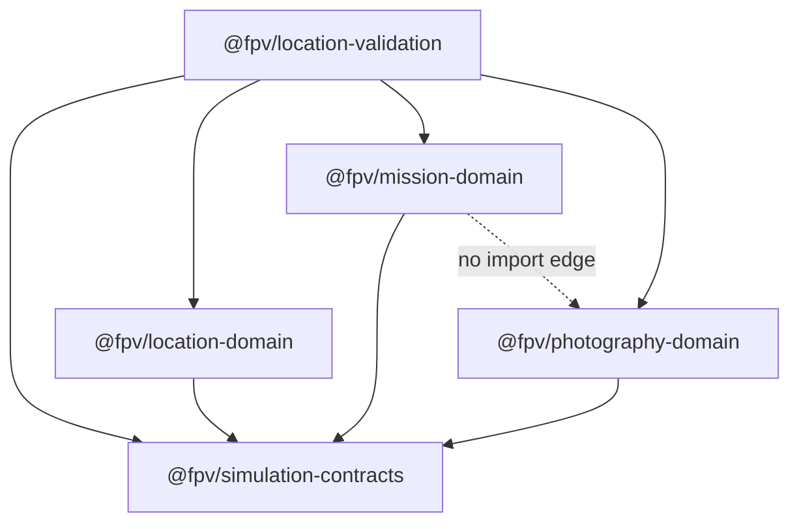
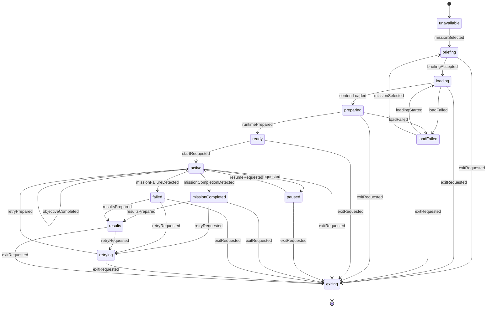

# FPV Simulator v1.3.0 — Checkpoint 2 Domain Foundations

**Milestone:** Curated Location and Photography Mission
**Checkpoint date:** 2026-07-27
**Official baseline:** Release `v1.2.1` (controller-calibration hotfix)
**Baseline commit:** `8405aa0fe6489e410d6f4519f52df319648018f4`
**Prior checkpoint:** [`v1.3.0-checkpoint-1-repository-audit.md`](./v1.3.0-checkpoint-1-repository-audit.md) (audited against `v1.2.0`)

This checkpoint delivers pure, framework-free domain packages only:
`simulation-contracts`, `location-domain`, `mission-domain`,
`photography-domain`, `location-validation`. No Angular UI, no `FlightComponent`
wiring, no `ThreeRendererService`/Rapier adapters, no IndexedDB, no final
Mediterranean location content, and no screenshot/photo-capture pipeline were
implemented. No controller-calibration code was touched. Checkpoint 2
acceptance locks architecture decisions for Checkpoint 3, corrects the
dependency documentation, and creates the Git checkpoint / PR — it does not
begin Checkpoint 3 implementation.

---

## 1. Verified v1.2.1 baseline

| Check | Result |
|---|---|
| Baseline commit | `8405aa0fe6489e410d6f4519f52df319648018f4` |
| Merge subject | `Merge pull request #7 from AmjadGn/hotfix/invert-yaw-axis-3` |
| Parent feature commit | `acd7001 fix(controller): invert yaw axis for stick-right-positive flight` |
| `v1.2.0 → v1.2.1` diff scope | Controller-calibration only: calibration schema v2, default yaw-axis inversion, a calibration-schema migration, and accompanying tests |
| Effect on Checkpoint 1 conclusions | None. Checkpoint 1's flight-authority, camera, environment, Rapier, and persistence findings were audited against `v1.2.0` and are unaffected — this is already recorded as a post-audit note appended to the Checkpoint 1 document |
| Working tree at Checkpoint 2 start | Dirty: `docs/architecture/v1.3.0-checkpoint-1-repository-audit.md` untracked (pre-existing Checkpoint 1 deliverable). No other dirty files. |
| Working tree at Checkpoint 2 end | Pre-existing untracked Checkpoint 1 audit retained; Checkpoint 2 added five new package trees, Checkpoint 2 architecture doc, and wiring edits to `packages/README.md`, `tsconfig.json`, `vitest.engineering.config.ts`. No production `src/app` source touched. |

Confirmation that is directly relevant to this checkpoint: `v1.2.1`'s entire
diff lives in the controller/calibration layer, which none of the five new
packages import, reference, or depend on (see §6). Nothing about the yaw
polarity fix required any change to domain contracts written in this
checkpoint.

---

## 2. Implemented package map

| Package | Files | Purpose |
|---|---|---|
| `packages/simulation-contracts` | `index.ts`, `math.ts`, `time.ts`, `coordinate-system.ts`, `camera.ts`, `spatial.ts`, `validation.ts`, `ids.ts`, `versioning.ts` | Shared pure math/time/spatial/camera/validation primitives consumed by every other new package |
| `packages/location-domain` | `index.ts`, `ids.ts`, `location-definition.ts`, `spatial-defs.ts`, `photography-subjects.ts`, `assets.ts`, `lighting-sky.ts`, `provenance.ts`, `create.ts`, `compatibility.ts` | Authored curated-location content model (`LocationDefinition`) |
| `packages/mission-domain` | `index.ts`, `ids.ts`, `mission-definition.ts`, `objectives.ts`, `policies.ts`, `state-machine.ts`, `session.ts`, `apply-objective.ts`, `results.ts`, `aircraft-capabilities.ts`, `aircraft-compatibility.ts`, `compatibility.ts` | Mission content, session/FSM, scoring aggregation, aircraft-compatibility policy |
| `packages/photography-domain` | `index.ts`, `ids.ts`, `objective.ts`, `evidence.ts`, `projection.ts`, `scoring-policy.ts`, `scoring.ts`, `feedback-codes.ts`, `validate-objective.ts` | Camera projection math, photo-objective/evidence contracts, deterministic scoring |
| `packages/location-validation` | `index.ts`, `context.ts`, `shared.ts`, `geometry.ts`, `validate-location.ts`, `validate-mission.ts`, `validate-all.ts` | Deep cross-field validation joining location/mission/photography content |

Every package ships its own `*.spec.ts` file(s) (see §18). `simulation-contracts`,
`location-domain`, `mission-domain`, `photography-domain`, and
`location-validation` are now wired into both `tsconfig.json` path aliases
and `vitest.engineering.config.ts` resolve aliases, matching the existing
`@fpv/<package-name>` convention used by the drone-builder engineering
packages (see `packages/README.md`).

---

## 3. Dependency direction



Conceptual structure (arrows mean **depends on** / imports from):

```text
                 simulation-contracts
                  ↑        ↑        ↑
                  │        │        │
          location-domain  │  photography-domain
                           │
                     mission-domain

location-validation
    ├── depends on simulation-contracts
    ├── depends on location-domain
    ├── depends on mission-domain
    └── depends on photography-domain
```

**Package naming note:** `@fpv/location-validation` currently validates
location, mission, and photography content. It is the validation boundary
for content distributed through versioned location/mission packages. It is
**not** renamed in this checkpoint. A future rename to
`@fpv/content-validation` may be considered only if package responsibilities
expand beyond curated location and mission content.

Rules enforced (and unit-tested, see §18):

- All five packages import only from `@fpv/simulation-contracts` among
  `@fpv/*` packages, except `location-validation`, which is the single
  package allowed to depend on `location-domain`, `mission-domain`, and
  `photography-domain` simultaneously (and also depends directly on
  `simulation-contracts`).
- **`mission-domain` does not import `photography-domain`.** Photography
  objectives are referenced from a mission only via an opaque
  `photographyObjectiveId: string` on `PhotographyObjectiveDefinition`
  (`objectives.ts`) — this is a deliberate anti-circularity choice, not an
  oversight. `location-validation` is the join point that resolves the
  opaque id against a real photography-objective catalog.
- Subject/zone ids crossing package boundaries (`SubjectId`, `ZoneId`,
  `PositionZoneId`, `landmarkId`) are locally branded opaque strings in each
  package's own `ids.ts`, never imported across packages — again resolved
  only inside `location-validation`.
- None of the five packages import `@angular/*`, `three`,
  `@dimforge/rapier3d-compat`, IndexedDB, or anything under `src/app`.

---

## 4. Public API responsibilities

| Package | Exposes | Deliberately does NOT expose |
|---|---|---|
| `simulation-contracts` | `Vec2/Vec3/Quat/Pose/Transform` + finiteness guards; `SimulationTick`/`ElapsedTicks`/`FixedStepDuration` brands + conversions; `SIMULATOR_COORDINATE_SYSTEM_V1`; `CameraProjection`/`CameraRigDefinition`/`CameraSnapshot` + `MISSION_CAPTURE_ASPECT_RATIO`; `Sphere/Aabb/Obb/AltitudeRange/NormalizedScreenPoint/PolygonPrism` + validating constructors; `ValidationIssue/ValidationReport` helpers; generic `Brand`; version-string helpers | Any renderer/physics/Angular type; no mutation helpers coupling callers to a specific math library |
| `location-domain` | Branded ids; `assets.ts` visual/collision/audio/presentation asset descriptors; `spatial-defs.ts` zones/boundaries/altitude bands/spawn/restart points; `PhotographySubjectDefinition`; lighting/sky config; `LocationDefinition` aggregate + `createLocationDefinition`; `checkLocationCompatibility` | Any fallback/placeholder location (explicitly forbidden, see §7); deep cross-field validation (that's `location-validation`'s job) |
| `mission-domain` | Branded ids; `MissionAircraftCapabilities` (normalized aircraft snapshot); `MissionAircraftCompatibilityPolicy` + `evaluateMissionAircraftCompatibility`; `ObjectiveDefinition` union + grouping; `CompletionPolicy/FailurePolicy/TimePolicy/ScoreAggregationPolicy`; `MissionDefinition` + `createMissionDefinition`; `MissionSessionState` + `createMissionSession`; `applyObjectiveResult`; `aggregateMissionResult`/`createMissionResultRecord`; mission-state-machine (`transitionMissionState`, `isLegalMissionTransition`); `checkMissionCompatibility` | `photography-domain` types (see §3); any raw controller/calibration/endurance field (see §6, §13) |
| `photography-domain` | Branded ids; projection math (`worldPointToCameraLocal`, `projectWorldPoint`, `projectSubjectSamplePoints`, screen-space aggregation, viewing angle/side, altitude/speed gates); `PhotographyObjectiveDefinition`; `PhotoCaptureEvidence` + `createPhotoCaptureEvidence`; `PhotographyScoringPolicy` + `createDefaultPhotographyScoringPolicy`; `evaluatePhotoCapture` + `quantize`; `FeedbackCode` vocabulary; `validatePhotographyObjective` | `mission-domain`/`location-domain` types (subject/zone ids are locally opaque, see §3); pixel/screenshot access of any kind |
| `location-validation` | `validateLocationDefinition`, `validateMissionDefinition`, re-exported `validatePhotographyObjective`, `validateAll`; `LocationValidationContext`/`MissionValidationContext` "known universe" input types | Any construction/mutation API — this package only reads and reports |

---

## 5. Coordinate and camera conventions

Authoritative source: `simulation-contracts/coordinate-system.ts` and
`camera.ts`.

```text
SIMULATOR_COORDINATE_SYSTEM_V1 (version "1.0.0"):
  handedness            = right
  +X = world right, +Y = world up, -Z = world backward's negation → aircraft forward
  aircraftForward       = (0, 0, -1)
  aircraftUp            = (0, 1, 0)
  aircraftRight         = (1, 0, 0)
  distanceUnit          = meters
  orientationConvention = body-to-world (v_world = q ⊗ v_body ⊗ q*)
```

Camera contracts (`camera.ts`):

- `PROJECTION_MODEL_VERSION = '1.0.0'`.
- `MISSION_CAPTURE_ASPECT_RATIO = 16 / 9` — the canonical aspect ratio used
  for scoring/recording, independent of live viewport aspect.
- `CameraProjection` (vertical FOV deg, aspect, near/far meters,
  `projectionModelVersion`) and `CameraRigDefinition` (optional
  `localMountPose` + projection + `stableMissionCaptureAspectRatio`) are pure
  data — no `THREE.PerspectiveCamera`, no device-pixel-ratio, and no
  camera-shake/look-lag/FOV-offset fields (those are explicitly excluded as
  runtime/cosmetic concerns layered on top elsewhere).
- `photography-domain/projection.ts` implements the actual math against this
  convention: camera looks down local `-Z`; screen space is top-left origin,
  `u` right, `v` down, optical center `(0.5, 0.5)`; quaternion helpers use a
  **reject-invalid** policy (non-finite or non-unit quaternions fail with
  `{ ok: false, reason }` rather than being silently renormalized or
  defaulted to identity).

This directly answers Checkpoint 1's Decision E ("canonical camera model")
at the pure-math level: the scoring math now has one authoritative
convention and one authoritative aspect-ratio constant. It does **not** yet
wire a `ResolvedFlightCameraRig` adapter to the live `AircraftDefinition` or
renderer — that remains Checkpoint 3 work (§19).

---

## 6. Confirmation: raw controller polarity is outside domain scope

This is enforced at four independent layers, not just by convention:

1. **Coordinate system doc comment** (`coordinate-system.ts`, lines 1–11):
   > "This is a pure geometric/spatial contract. It intentionally says
   > nothing about controller/input axis polarity, stick inversion, or
   > calibration... Do not add controller-axis fields to this module."
2. **`MissionAircraftCapabilities`** (`aircraft-capabilities.ts`) is
   documented as already-normalized authoritative state containing "NONE of
   the following: raw controller axis values or mappings, calibration
   version/state, stick inversion flags, input device identity."
3. **Defensive rejection in `mission-domain/aircraft-compatibility.ts`**:
   `FIELD_UNSUPPORTED_KEYS` includes `controllerCalibrationVersion`,
   `yawInverted`, `rawAxisMapping`; both
   `evaluateMissionAircraftCompatibility` (via
   `scanForUnsupportedConstraints`) and the standalone
   `assertNoUnsupportedAircraftConstraints` reject these keys even if they
   arrive via an `as`-cast/untrusted payload that bypasses the TypeScript
   shape.
4. **Defensive rejection in `photography-domain/evidence.ts`**:
   `FORBIDDEN_AIRCRAFT_SNAPSHOT_KEY_TERMS` (`controller`, `stick`, `gamepad`,
   `joystick`, `calibration`, `invert`, `deadzone`, `trim`, `throttleinput`,
   etc.) is scanned via `findForbiddenAircraftSnapshotKeys` and
   `createPhotoCaptureEvidence` rejects construction if any match.
5. **Defensive recursive scan in `location-validation/validate-mission.ts`**:
   `scanForControllerCalibrationFields` walks an entire (possibly raw/JSON)
   mission-definition payload at any depth looking for
   `controllerCalibrationVersion`, `yawInverted`, `rawAxisMapping`,
   `gamepadAxes`, `calibration`, emitting
   `CONTROLLER_FIELD_IN_MISSION_DEFINITION` for each hit.

All five mechanisms are unit-tested (see §18). Net effect: the `v1.2.1`
yaw-inversion/calibration-schema-v2 change cannot leak into mission,
location, or photography scoring even if a future caller tries to smuggle
it through untyped data — the boundary is structural and defended, not just
documented.

---

## 7. Location domain model

`LocationDefinition` (`location-definition.ts`) is the aggregate root:

```text
LocationDefinition
  identity:               { locationId, packageVersion, schemaVersion, compatibilityVersion }
  display, realWorldInspiration
  coordinateSystem:       CoordinateSystemConvention (must match SIMULATOR_COORDINATE_SYSTEM_V1)
  worldOrigin:            Pose
  playableBoundary / softWarningBoundary? / hardBoundary
  altitudeConstraints:    AltitudeRange
  visualScene:            { terrainVisualAssetId?, modelAssetIds[], textureAssetIds[] }
  collisionScene:         { terrainCollisionAssetId?, obstacleCollisionAssetIds[], requiresTerrainCollision }
  gameplaySpatial:        { zones[], altitudeBands[], spawnPoints[], restartPoints[] }
  photographySubjects:    PhotographySubjectDefinition[]
  lighting, sky
  supportedQualityTiers, performanceMetadata, runtimeCompatibility
  provenanceRecordIds[], assets[]
```

Key design decisions:

- **Visual/collision content separation is structural, not just a
  convention**: `VisualSceneDescription` and `CollisionSceneDescription` are
  independent fields. `assets.ts` documents "a visual mesh is never
  collision authority and a collision mesh is never rendered" — enforced at
  the validation layer (§15).
- **Quality-tier invariance**: changing `supportedQualityTiers` must never
  change zones, altitude bands, spawn/restart points, photography subjects,
  boundaries, or collision-critical geometry — nothing in `create.ts` reads
  `supportedQualityTiers` when assembling those fields (unit-tested: "quality
  tiers do not need to mutate gameplay-critical fields").
- **No fallback location, ever**: the module doc for
  `location-definition.ts` explicitly forbids defining/exporting anything
  resembling the application's `FALLBACK_ENVIRONMENT_ID`
  (`'fallback-flat'`) — this is a deliberate rejection of Checkpoint 1's
  finding that the app's procedural fallback is a rendering-layer concern
  (unit-tested: "no fallback-flat registration").
- **Photography subjects are hand-authored, not runtime-generated**:
  `visibilitySamplePoints` on `PhotographySubjectDefinition` must be
  deterministic authored content so scoring is reproducible/replayable.
- `createLocationDefinition` performs only structural assembly (id branding,
  defaulting, defensive array copies, `Object.freeze`) and throws only on
  programmer-misuse-level problems (empty ids, negative estimates) — it
  deliberately does **not** validate spawn-point containment, asset
  reference existence, or subject reachability; that is
  `location-validation`'s job (§16).
- `checkLocationCompatibility` performs exactly two checks: coordinate
  system version exact match, and runtime compatibility version ≥ the
  location's declared minimum on the same major version (mirrors
  `isCompatibleMajor` semantics).

---

## 8. Mission domain model

`MissionDefinition` (`mission-definition.ts`) is the aggregate root:

```text
MissionDefinition
  metadata, missionId, versions: { version, schemaVersion }
  requiredLocationId, locationVersionRange: { min, max }
  briefing
  aircraftCompatibilityPolicy: MissionAircraftCompatibilityPolicy
  objectives: ObjectiveDefinition[]     (photography | reach_zone | return_to_zone)
  grouping:   { mode: 'sequential' | 'all_of', requiredObjectiveIds[], optionalObjectiveIds?, bonusObjectiveIds? }
  completionPolicy, failurePolicy, timePolicy, scoreAggregationPolicy
  resultsMetadata?
  compatibilityVersion
```

Notable design points:

- `createMissionDefinition` validates cheap, unconditional structural
  invariants only (unique objective ids, grouping references resolve to real
  objectives, `locationVersionRange.min <= max`,
  `completionPolicy.minimumCount` in range) and throws on violation — full
  aircraft/location context checks live in `compatibility.ts` instead.
- **Session state is split from lifecycle state.** `MissionSessionState`
  (`session.ts`) tracks per-objective progress, `currentObjectiveId`,
  `elapsedTicks`, and `retryCount`; the coarse lifecycle FSM lives entirely
  in `state-machine.ts` (§11) and holds no data of its own.
  `applyObjectiveResult` (`apply-objective.ts`) is a pure reducer that
  updates objective progress and advances `currentObjectiveId` for
  sequential missions, without touching lifecycle state.
- **Pass/fail is decided by required-objective completion, not score.**
  `aggregateMissionResult` (`results.ts`) explicitly documents: "A mission
  with a low score but all required objectives completed is still
  `'completed'`; a mission that racked up bonus points but missed a required
  objective is still `'failed'`." Score is computed independently: required
  points × `requiredWeight` + optional bonus points × `optionalBonusWeight`
  + a time bonus (only if all required objectives completed within
  `targetElapsedTicks`), rounded and clamped to `maxScore`.
- `MissionAircraftCapabilities` (`aircraft-capabilities.ts`) is the **only**
  aircraft-shaped input mission-domain ever consumes — an already-normalized
  DTO (never a raw drone-build, controller state, or Angular signal). See
  §6 and §12–13 for what it deliberately excludes.

---

## 9. Photography evidence model

`PhotoCaptureEvidence` (`evidence.ts`) is an immutable, schema-versioned
record of one capture attempt, built by an application-layer adapter from
**post-collision-correction** aircraft state and a **canonical
(cosmetics-free)** camera snapshot:

```text
PhotoCaptureEvidence
  identity:          { evidenceId, objectiveId, missionAttemptId?, attemptNumber, capturedAtTick, schemaVersion }
  aircraftSnapshot:  { aircraftId, pose, linearVelocityMps, bodyAngularVelocityRadps,
                        altitudeMeters, armed, crashed, positionZoneId? }
  cameraSnapshot:    { worldPose, projection, cameraMode, cosmeticEffectsExcluded: true }
  spatialContext:    { lineOfSightRatio, obstructionRatio, distanceToPrimarySubjectMeters? }
  subjectObservations: SubjectObservation[]
  stability:         { stableDurationTicks, requiredDurationTicks, isStable }
```

`createPhotoCaptureEvidence` is a validating constructor (never throws;
returns `{ ok, value }` / `{ ok: false, reason }`) that additionally:

- Rejects if `aircraftSnapshot` contains any forbidden controller/calibration
  key (§6).
- Rejects if `cameraSnapshot.cosmeticEffectsExcluded !== true` — evidence
  must assert that shake/look-lag/FOV-offset were stripped before capture.
- Rejects if the camera projection's `projectionModelVersion` is not
  major-compatible with `PROJECTION_MODEL_VERSION` — evidence captured under
  an incompatible projection model cannot be safely scored (a version
  boundary, see §17).
- Rejects if `stability.isStable` is inconsistent with
  `stableDurationTicks >= requiredDurationTicks` — scoring trusts this
  invariant instead of recomputing it.
- Freezes the returned value (and its direct nested objects).

`SubjectObservation` per subject carries `visible`, `visibilityRatio`,
`screenRectangle`, `centeringErrorFromCenter`, `distanceMeters`,
`viewingAngleDeg`, `viewingSide`, `coverageRatio`, `frameIntersectionRatio`
— all pre-computed by the (not-yet-implemented) application-layer projection
adapter, not derived inside evidence itself.

---

## 10. Scoring determinism policy

`photography-domain/scoring.ts`'s `evaluatePhotoCapture` implements five
explicit, documented, and unit-tested determinism rules:

1. **Quantize before every comparison.** Every raw numeric evidence/objective
   input used in a threshold check or score computation passes through
   `quantize(value, scale)` first (`scale = policy.quantizationScale`,
   default `1_000_000` via `createDefaultPhotographyScoringPolicy`). This
   removes floating-point jitter so structurally identical captures always
   compare/score identically and threshold checks never flap on sub-ULP
   noise.
2. **Every component score is an integer** in `[0, componentMaxScore]`,
   produced via `Math.round(...)`.
3. **Fixed aggregation/serialization order.** Components are always
   summed/serialized in `SCORING_COMPONENT_ORDER` — `visibility, framing,
   centering, coverage, distance, viewingAngle, altitude, positionZone,
   lineOfSight, stability, bonus` — regardless of internal computation
   order.
4. **Stable subject ordering.** Subjects are processed in **ordinal**
   string order of `subjectId` (`compareOrdinal`, deliberately not
   `localeCompare`, to avoid ICU/locale-dependent ordering differences
   across JS engines/builds).
5. **No non-deterministic sources.** No `Date.now`, `Math.random`,
   `performance.now`, or similar is read anywhere in the module.

Default scoring policy (`scoring-policy.ts`) totals 120 points: visibility
20, framing 10, centering 10, coverage 10, distance 10, viewingAngle 10,
altitude 5, positionZone 5, lineOfSight 10, stability 10, bonus 10.

This is directly verified by tests, not just asserted by comment:
`scoring.spec.ts` includes a "golden 15: identical evidence repeated" case
asserting **byte-identical `JSON.stringify`** output across two calls, plus
a "determinism: 200+ repeated evaluations per core scenario" suite that
repeats five golden scenarios 200× each and asserts identical results every
time (all passing, see §18).

---

## 11. State-machine design

`mission-domain/state-machine.ts` implements a pure, total reducer over 13
states with an explicit transition table — no implicit fallback state, no
silent event-drop.



Design notes:

- `transitionMissionState(state, event)` returns a discriminated
  `MissionTransitionResult`: `{ ok: true, state }` or `{ ok: false, code:
  'ILLEGAL_TRANSITION', from, event, message }`. It never throws and never
  guesses a fallback — every `(state, eventType)` pair not explicitly listed
  in `TRANSITION_TABLE` is illegal by construction.
- The one deliberate self-transition is `active` + `objectiveCompleted` →
  `active`: completing an objective never changes the coarse lifecycle
  state by itself. Objective bookkeeping is delegated entirely to
  `applyObjectiveResult` operating on `MissionSessionState` (§8).
- `isLegalMissionTransition(state, eventType)` exposes the same table for
  callers that need a boolean check without constructing an event.
- Test coverage is exhaustive: `mission-state-machine.spec.ts` (221 tests)
  checks every legal transition, every illegal transition, plus
  exhaustiveness sanity checks and named end-to-end scenarios.

---

## 12. Compatibility limitations

Two independent, narrower-than-you-might-expect compatibility surfaces:

**Aircraft compatibility** (`mission-domain/aircraft-compatibility.ts`):
`MissionAircraftCompatibilityPolicy` is a closed, structurally-typed shape —
`allowedCategories`, `prohibitedCategories`, dimension/mass/TWR/speed
ceilings, `requireCamera` + `fovRangeDeg`, `requireCollisionProfile`, plus
two advisory-only fields (`recommendedAircraftIds`/`recommendedCategories`
never gate compatibility). `evaluateMissionAircraftCompatibility` returns
`'compatible' | 'compatibleWithWarnings' | 'incompatible'` with a typed
`CompatibilityIssue[]` (never throws). Missing runtime data surfaces as a
`warning`-severity `INSUFFICIENT_RUNTIME_DATA`, not a hard failure —
compatibility degrades to "can't verify" rather than silently passing or
crashing.

**Location compatibility** (`location-domain/compatibility.ts`):
exactly two checks — coordinate-system version exact match, and runtime
compatibility version ≥ the location's declared minimum on the same major
version. `checkMissionCompatibility` (`mission-domain/compatibility.ts`)
composes the aircraft check with an optional `locationVersionRange`
membership check (`LOCATION_VERSION_OUT_OF_RANGE`) — location version
checking is skipped entirely if the caller doesn't supply
`ctx.locationVersion`.

Both are pure/total and produce a `status` + `issues[]` — no side effects,
no thrown exceptions, safe to call speculatively (e.g. from UI
recommendation lists) before a session actually starts.

---

## 13. Unsupported endurance decision

Endurance is **informational-only and can never become a hard gate**, by
construction, not just by policy:

- `MissionAircraftCapabilities.estimatedEnduranceMinutes` is documented:
  "NEVER a hard blocking constraint for mission eligibility...
  `aircraft-compatibility.ts` has no mechanism to gate on this field, and
  any attempt to smuggle an endurance constraint into a policy is
  rejected."
- `MissionAircraftCompatibilityPolicy` has **no field** for endurance,
  battery minutes, or consumption at all — structurally, not just by
  convention (unit-tested: "the aircraft compatibility policy type has no
  field for endurance, structurally").
- `ENDURANCE_UNSUPPORTED_KEYS = ['enduranceMinutesMin', 'batteryConsumption']`
  is defensively scanned by `scanForUnsupportedConstraints` and
  `assertNoUnsupportedAircraftConstraints`, producing an error-severity
  `UNSUPPORTED_CONSTRAINT_ENDURANCE` issue if either key is present on an
  untyped/untrusted policy payload.
- `location-validation/validate-mission.ts` calls
  `assertNoUnsupportedAircraftConstraints` on every mission's
  `aircraftCompatibilityPolicy` and remaps the issue to
  `UNSUPPORTED_ENDURANCE_CONSTRAINT`.

This directly mirrors and closes out the Checkpoint 1 finding that
`flightDurationMinutesMin/Max` exists only on `CompiledAircraftSpecification
.performance` (via `calculatePerformanceMetrics`) and is never copied onto a
flyable `AircraftDefinition`, and that there is no runtime battery-drain
consumer today. The domain layer now makes it structurally impossible for a
future mission author (or a bug) to accidentally gate a mission on
endurance.

---

## 14. Compiled camera and collider template limitation

Checkpoint 1 found that user-compiled aircraft use a **clone template**
camera/collision pack (`compiled-aircraft-definition.factory.ts`), not
build-specific optics/colliders. This checkpoint's domain packages encode
that limitation explicitly rather than silently trusting compiled data:

- `CameraProfileCapability.provenance: 'runtime' | 'template-derived'`
  (`aircraft-capabilities.ts`).
- `MissionAircraftCapabilities.collisionProvenance?: 'runtime' |
  'template-derived'`.
- `evaluateMissionAircraftCompatibility` surfaces
  `TEMPLATE_DERIVED_CAMERA` / `TEMPLATE_DERIVED_COLLISION` as
  **warning**-severity issues (never blocking) whenever provenance is
  `'template-derived'`, and `INSUFFICIENT_RUNTIME_DATA` when collision is
  available but provenance is entirely unknown.
- `FIELD_UNSUPPORTED_KEYS` additionally rejects `buildSpecificOptics` and
  `buildSpecificColliderPrecision` if smuggled into a policy — a mission
  can never require build-specific optical/collider precision that the
  runtime cannot actually guarantee.

This is domain-side plumbing for a known limitation, not a fix: no adapter
yet populates `provenance`/`collisionProvenance` from the real
`AircraftRuntimeService` / `AircraftDefinition` — that adapter is Checkpoint
3 scope (§19).

---

## 15. Collision-content requirements

Enforced by `location-domain/assets.ts` (structural) and
`location-validation/validate-location.ts` (cross-field, at content-authoring
time — not runtime):

- **Content separation is structural**: `VisualModelAsset` / `TextureAsset`
  are rendering-only; `CollisionMeshAsset` / `TerrainCollisionAsset` are the
  only asset kinds treated as collision authority.
- `CollisionSceneDescription.requiresTerrainCollision: boolean` — if `true`
  but `terrainCollisionAssetId` is absent, validation raises
  `MISSING_TERRAIN_COLLISION`.
- Every `obstacleCollisionAssetIds` entry and `terrainCollisionAssetId` must
  resolve to an asset whose `kind` is `'collision-mesh'` or
  `'terrain-collision'` — resolving to any other kind (e.g. a visual model)
  raises `VISUAL_USED_AS_COLLISION`.
- `terrainCollisionAssetId` must not equal `visualScene.terrainVisualAssetId`
  — reusing the same asset id for visual and collision terrain is rejected
  outright.
- `PhotographySubjectDefinition.collisionQueryRefIds` (optional
  line-of-sight/occlusion asset references) are validated the same way:
  each ref must resolve to a collision-authority asset kind
  (`UNKNOWN_COLLISION_REF` otherwise).
- Required assets must ship a variant for every quality tier the location
  declares in `supportedQualityTiers` (`QUALITY_TIER_INCONSISTENT`
  otherwise) — a required collision asset can never silently disappear at a
  lower quality tier.

---

## 16. Validation architecture

`location-validation` is the single package permitted to perform deep,
cross-field, cross-package validation — deliberately kept separate from the
"basic structural assembly" constructors in `location-domain`/`mission-domain`
(`createLocationDefinition`, `createMissionDefinition`), which only guard
against programmer misuse.

- `validateLocationDefinition(location, context?)` — identity/version
  fields, exact coordinate-system match against
  `SIMULATOR_COORDINATE_SYSTEM_V1`, id uniqueness across assets/zones/
  subjects/spawn/restart/provenance, asset-reference existence and
  collision-authority-kind checks (§15), altitude range validity, boundary/
  zone shape finiteness, spawn/restart point containment inside the hard
  boundary, photography-subject bounds/sample-point finiteness and
  landmark-ref existence (if a landmark catalog is supplied), asset checksum
  format (`sha256`, 64 hex chars) and quality-tier coverage, and provenance
  cross-referencing.
- `validateMissionDefinition(mission, context?)` — identity/version fields
  (including schema-major compatibility against `MISSION_SCHEMA_VERSION`),
  objective id uniqueness, sequential-grouping ordering constraints (e.g. a
  `return_to_zone` objective with `afterRequiredObjectives: true` must be
  ordered last), required-location-id match against a supplied
  `LocationDefinition`, zone-reference existence, **recursive
  controller-calibration field scanning** (§6), completion-policy validity,
  optional/bonus objectives never overlapping required ids, time-policy
  consistency (`timeBonus.targetElapsedTicks <= hardLimitTicks`), aircraft
  constraint scanning (§13), and — when a photography-objective catalog and
  scoring policy are supplied — cross-referencing each mission's
  `photographyObjectiveId` against real objectives/subjects/zones on the
  target location, including an `IMPOSSIBLE_REQUIRED_SUBJECT_COUNT` check
  (an objective's `minRequiredSubjectCount` exceeding how many of its
  `requiredSubjectIds` actually exist on the location).
- `validateAll({ location?, locationContext?, mission?, missionContext? })`
  — convenience composition merging both reports via
  `simulation-contracts`'s `mergeReports`.
- Every validator returns a `ValidationReport` (`{ ok, issues[] }`) and
  **never throws**, even for content that doesn't actually conform to its
  declared TypeScript type at runtime (raw JSON, `as`-casts) — this is
  tested directly (`validatePhotographyObjective never throws on malformed
  input`, plus internal `try/catch` wrappers in both `validate-location.ts`
  and `validate-mission.ts` that convert unexpected exceptions into a single
  `*_VALIDATION_INTERNAL_ERROR` issue rather than propagating).
- `LocationValidationContext` / `MissionValidationContext` model "known
  universe" inputs (known asset ids, provenance records, landmark ids,
  photography-objective catalog, scoring policies, target location) as
  **all-optional** fields — omitting a field means "don't check that
  dimension," never "assume it's empty."

---

## 17. Version boundaries

| Version constant | Package | Governs | Compatibility rule used |
|---|---|---|---|
| `COORDINATE_SYSTEM_VERSION` (`'1.0.0'`) | `simulation-contracts` | The `+X/+Y/-Z` right-handed body-to-world convention | **Exact match** required (`validateLocationDefinition`) |
| `LOCATION_SCHEMA_VERSION` (`'1.0.0'`) | `location-domain` | Structural shape of `LocationDefinition` itself | Set at construction; checked as an exact-version string by `location-validation` |
| `MISSION_SCHEMA_VERSION` (`'1.0.0'`) | `mission-domain` | Structural shape of `MissionDefinition` itself | **Same-major** compatibility (`isCompatibleMajor`) |
| `PHOTOGRAPHY_OBJECTIVE_SCHEMA_VERSION` (`'1.0.0'`) | `photography-domain` | Structural shape of `PhotographyObjectiveDefinition` | Per-objective `version` field checked as an exact `major.minor.patch` string |
| `EVIDENCE_SCHEMA_VERSION` (`'1.0.0'`) | `photography-domain` | Structural shape of `PhotoCaptureEvidence` | Carried on `identity.schemaVersion`; not yet cross-checked by a validator (application-layer concern once evidence starts flowing through persistence) |
| `SCORING_POLICY_VERSION` (`'1.0.0'`) | `photography-domain` | `PhotographyScoringPolicy` shape/weights | Checked as an exact version string; cross-checked for component completeness against `SCORING_COMPONENT_ORDER` |
| `PROJECTION_MODEL_VERSION` (`'1.0.0'`) | `simulation-contracts` | Camera projection math semantics (`projection.ts`) | **Same-major** compatibility — `createPhotoCaptureEvidence` rejects evidence whose `cameraSnapshot.projection.projectionModelVersion` isn't major-compatible |
| `LocationCompatibilityVersion` / `minRuntimeCompatibilityVersion` | `location-domain` | Location-vs-simulator-runtime compatibility | Same-major, runtime minor.patch ≥ location's declared minimum |
| `MissionCompatibilityVersion` | `mission-domain` | Mission-vs-aircraft-runtime compatibility | Same-major (`isCompatibleMajor`) against `MissionAircraftCapabilities.runtimeCompatibilityVersion` |

**Explicitly not a version boundary here:** controller-calibration schema
(bumped to v2 in `v1.2.1`). None of the above version constants reference
it, and §6's defensive scans guarantee raw calibration data cannot enter
any of these versioned surfaces regardless of its own schema version.

---

## 18. Tests and golden scenarios

All engineering-package tests pass: **496 tests across 18 files** via
`npm run test:engineering` (`vitest.engineering.config.ts`, which includes
`packages/**/*.spec.ts` plus `src/app/core/engineering/**/*.spec.ts`).

> Note: this repository's `package.json` pins `"engines": { "node":
> "22.22.3" }` (a Checkpoint 1 low-severity risk). Running the suite under
> Node 18 fails immediately with `ERR_REQUIRE_ESM` while loading
> `vitest.engineering.config.ts`; running under Node 22 (`nvm use 22`)
> passes cleanly. This reconfirms the Checkpoint 1 finding — it is not new
> to Checkpoint 2, but it will block anyone validating this checkpoint's
> tests on an unmanaged Node install.

Per-package test counts (new packages only):

| Package | Spec file(s) | Tests |
|---|---|---|
| `simulation-contracts` | `simulation-contracts.spec.ts` | 31 |
| `location-domain` | `location-domain.spec.ts` | 13 |
| `mission-domain` | `aircraft-compatibility.spec.ts` (34), `mission-domain.spec.ts` (22), `mission-state-machine.spec.ts` (221) | 277 |
| `photography-domain` | `photography-domain.spec.ts` (7), `projection.spec.ts` (24), `scoring.spec.ts` (21) | 52 |
| `location-validation` | `location-validation.spec.ts` | 44 |

Golden-scenario coverage worth calling out specifically:

- **`projection.spec.ts`** — 12 numbered geometry goldens (centered subject,
  frame edge, outside frame, behind camera, rotated camera, yaw 90°/180°,
  pitch tilt, partial-frame intersection, invalid quaternion rejection,
  near-plane clipping, aspect-ratio invariance of vertical FOV) plus
  quaternion invert/rotate reject-invalid-policy tests and distance/viewing-
  angle/viewing-side/altitude/speed helper tests.
- **`scoring.spec.ts`** — 15 numbered scoring goldens (perfect centered,
  frame edge, partial outside frame, too close, too far, wrong viewing
  side, fully occluded, partially obstructed, high angular velocity, stable
  capture, multi-subject with one missing, outside position zone, exact
  inclusive-boundary thresholds, bonus composition, identical-evidence
  byte-for-byte repeat) plus a dedicated "200+ repeated evaluations per core
  scenario" determinism suite (§10).
- **`mission-state-machine.spec.ts`** — exhaustive legal-transition and
  illegal-transition coverage over the full `MISSION_STATES ×
  MISSION_STATE_EVENT_TYPES` space, plus exhaustiveness sanity checks and
  named end-to-end scenarios (§11).
- **`location-domain.spec.ts`** — includes explicit "no fallback-flat
  registration" tests (§7) and a "produces identical zones/spawnPoints/
  photographySubjects across different quality-tier sets" invariance test.
- **`photography-domain.spec.ts`** — includes an explicit import-boundary
  guard ("never imports Angular, Three.js, Rapier, mission-domain, or
  location-domain"; "only imports from `@fpv/simulation-contracts` among
  `@fpv/*` packages") and forbidden-controller-key tests (§6), plus an
  end-to-end smoke test (project → build evidence → validate objective →
  score).
- **`mission-domain.spec.ts`** — includes an explicit "no controller/
  calibration/device data ever appears in its types" suite (serialized
  `MissionAircraftCapabilities`/`MissionDefinition` samples scanned for
  controller/calibration terms) and a "public API surface: exposes every
  documented top-level function" test guarding `index.ts` against silent
  export drift.
- **`location-validation.spec.ts`** — the broadest cross-field suite: every
  location-side error code (`MISSING_TERRAIN_COLLISION`,
  `VISUAL_USED_AS_COLLISION`, `COORDINATE_SYSTEM_MISMATCH`, `MISSING_ASSET`,
  duplicate/empty ids, `INVALID_CHECKSUM`, `QUALITY_TIER_INCONSISTENT`,
  `MISSING_PROVENANCE`, boundary/finite-number checks, spawn/restart
  containment, subject checks, altitude range) and every mission-side error
  code (`INVALID_SUBJECT_REFERENCE`, `IMPOSSIBLE_REQUIRED_SUBJECT_COUNT`,
  `UNSUPPORTED_ENDURANCE_CONSTRAINT`, `INVALID_SCORE_WEIGHTS`,
  cross-validated `COORDINATE_SYSTEM_MISMATCH` via `validateAll`,
  `CONTROLLER_FIELD_IN_MISSION_DEFINITION`, `UNSUPPORTED_VERSION`,
  `DUPLICATE_OBJECTIVE_ID`, `INVALID_ZONE_REFERENCE`, and more) each get a
  dedicated `describe` block.

CI already runs this suite with `UPDATE_GOLDENS: '0'` (`.github/workflows
/ci.yml`), matching the project's existing golden-file discipline from the
drone-builder engineering packages — no CI wiring change was needed for the
new packages since they slot into the existing `packages/**/*.spec.ts` glob
and alias map.

---

## 19. Exact scope deferred to Checkpoint 3

Every alignment seam identified in Checkpoint 1 §18/§25 remains
**unimplemented** after Checkpoint 2 — this checkpoint delivered contracts
only, no adapters:

- No `ResolvedFlightCameraRig` builder or adapter reading
  `AircraftDefinition.cameraProfile.fpv` — `CameraRigDefinition`/
  `CameraSnapshot` exist as pure contracts in `simulation-contracts`, but
  nothing constructs one from a real aircraft/renderer yet.
- No fixed-step hook seam inside `FlightComponent.onFixedStep` — the mission
  state machine and session model exist, but nothing calls
  `transitionMissionState`/`applyObjectiveResult` from a live frame.
- No integer simulation-tick counter wired to `FlightControllerService` —
  `SimulationTick`/`ElapsedTicks`/`FixedStepDuration` brands and
  `secondsToTicks`/`ticksToSeconds` conversions exist in
  `simulation-contracts/time.ts` (floor-conversion policy documented), but
  no runtime source produces them yet.
- No `MissionSpatialQueryPort` implementation or Rapier adapter — nothing in
  these packages references Rapier at all (by design).
- No `MissionAircraftSnapshotAdapter` populating `MissionAircraftCapabilities`
  from a real `AircraftDefinition`/`AircraftRuntimeService` — §14's
  `provenance`/`collisionProvenance` fields exist but are unpopulated by any
  adapter.
- No `LocationToEnvironmentAdapter` — `LocationDefinition` has no consumer
  that turns it into anything the existing render/physics mount path
  understands.
- No `MissionLaunchIntent` extension on `AppShellService` — the `mission`
  `FlightLaunchIntent` variant proposed in Checkpoint 1 §3 was not added.
- No `PhotoCaptureCoordinator` / screenshot capture adapter — evidence
  construction (§9) has no producer.
- No mission persistence (`fpv-missions-v1` IndexedDB) — no store, no
  schema migration, nothing written.

---

## 20. Files expected to change in Checkpoint 3

Illustrative touch list, consistent with Checkpoint 1 §24, this
checkpoint's actual package boundaries, and the locked decisions below:

- `src/app/core/shell/app-shell.service.ts` — add a `mission` variant to
  `FlightLaunchIntent`. Navigation remains under Fly → Expeditions for
  v1.3.0 (see Locked Decisions).
- `src/app/features/flight/flight.component.ts` — add the named fixed-step
  hook seam after collision correction (no mission logic beyond the call
  site).
- Runtime adapter / reusable flight-runtime seam — own the explicit integer
  simulation-tick counter (do **not** place mission-specific state inside
  `FlightControllerService`; see Locked Decisions §3).
- New `src/app/core/mission/**` — ports, adapters (`MissionAircraftSnapshot
  Adapter`, `ResolvedFlightCameraRig` builder, `MissionSpatialQueryPort`
  Rapier adapter), coordinators (`MissionLaunchCoordinator`,
  `LocationLoadCoordinator` stub, `MissionRuntimeCoordinator`, thin
  `MissionSessionFacade`), models.
- `src/app/core/rendering/utils/flight-frame-sync.ts` — align the Three.js
  FPV camera adapter to `ResolvedFlightCameraRig` while preserving current
  visible camera feel (legacy compatibility mode first; see Locked
  Decisions §2).
- `docs/aircraft-cameras.md` — correctness fix (documented as stale in
  Checkpoint 1 §7).
- `vitest.engineering.config.ts` — additional aliases only if a new package
  (e.g. `mission-persistence`) is introduced.
- `docs/architecture/*` — ADRs and a Checkpoint 3 report.

Still forbidden in Checkpoint 3 per the Checkpoint 3 brief: final
Mediterranean location assets, screenshot-based scoring, and IndexedDB
mission writes, unless separately approved.

---

## 21. Risks and remaining open decisions

### Risks

| Risk | Severity | Notes |
|---|---|---|
| Determinism is contract-level, not yet pipeline-level | Medium | `evaluatePhotoCapture` is provably deterministic given identical `PhotoCaptureEvidence`, but no adapter yet produces that evidence from live gameplay — jitter could still enter upstream of evidence construction in Checkpoint 3 |
| Camera/collision provenance fields are unpopulated | Medium | §14's `provenance`/`collisionProvenance` plumbing exists but nothing sets it yet; a naive Checkpoint 3 adapter could default it incorrectly (e.g. always `'runtime'`) and silently hide template-derived optics/colliders |
| Node engine mismatch blocks local verification | Low | Reconfirmed from Checkpoint 1; contributors on Node 18 cannot run `test:engineering` at all (`ERR_REQUIRE_ESM`), not just get different results |
| `EVIDENCE_SCHEMA_VERSION` has no compatibility check yet | Low | Unlike `PROJECTION_MODEL_VERSION`, nothing currently rejects evidence built under a mismatched `EVIDENCE_SCHEMA_VERSION` — acceptable now since nothing persists evidence yet, but should be revisited once mission persistence lands |
| Replay clear-data key mismatch (deferred defect) | Low | Unchanged from Checkpoint 1; `clearLocalProductData` removes `fpv-trainer.replay.latest.v1` while the live replay key is `fpv-trainer.latest-replay.v1` (`local-store.ts` vs `replay.model.ts`'s `REPLAY_STORAGE_KEY`). Not touched by this checkpoint — pure domain packages have no persistence code — and still needs a fix before/alongside mission persistence work. **Do not fix in this acceptance checkpoint.** |

### Former open decisions — now locked

The five product/architecture questions carried from Checkpoint 1 §25 are
**locked** for Checkpoint 3. See
[Locked Decisions for Checkpoint 3](#locked-decisions-for-checkpoint-3)
below. No further product confirmation is required before Checkpoint 3
implementation may begin on those topics.

---

## Locked Decisions for Checkpoint 3

Accepted and locked at Checkpoint 2 acceptance. Checkpoint 3 must implement
against these decisions. This acceptance task documents them only — it does
**not** implement camera resolvers, tick counters, navigation, or location
content.

### 1. Mission Photography Aspect Ratio

The authoritative photography scoring aspect ratio is **16:9**.

The intended shared constant is:

```text
MISSION_CAPTURE_ASPECT_RATIO
```

Conceptual value:

```text
16 / 9
```

This constant already exists in `simulation-contracts/camera.ts` and must
remain free of browser, canvas, or device-resolution dependencies. This
acceptance task does **not** change existing production camera behavior.

### 2. Canonical Camera Strategy

Checkpoint 3 will introduce:

```text
ResolvedFlightCameraRig
```

It becomes the authoritative base-camera contract shared by:

* deterministic photography projection
* the Three.js FPV camera adapter

The migration must preserve the current visible camera feel. The initial
resolver should support a **legacy compatibility mode** capable of
reproducing the current renderer camera mount, tilt, and base FOV before
aircraft profiles are progressively normalized.

This is **not** permission to maintain two unrelated camera authorities.
The intended model is:

```text
ResolvedFlightCameraRig
    ├── deterministic photography camera snapshot
    └── Three.js visual camera base pose
            └── cosmetic presentation effects
```

Cosmetic effects include:

* camera shake
* look lag
* impact effects
* visual dynamic FOV
* presentation-only noise

Cosmetic effects must remain excluded from scoring evidence.
`ResolvedFlightCameraRig` is **not** implemented in this acceptance task.

### 3. Simulation Tick Ownership

The mission simulation tick will be an explicit integer counter owned by the
live fixed-step session/runtime integration boundary.

It must:

* increment exactly once for each completed authoritative fixed step
* increment after Rapier collision correction
* be available before mission fixed-step processing
* reset when a new flight or mission session starts
* remain independent from wall-clock time
* remain independent from render frames
* not be derived by repeatedly dividing floating-point elapsed time
* not be owned by photography-domain
* not be owned by mission-domain
* not be added to raw controller calibration
* not reinterpret controller-axis polarity

Do **not** place mission-specific state inside `FlightControllerService`.

Checkpoint 3 should implement this through a runtime adapter or reusable
flight-runtime seam. It is **not** implemented in this acceptance task.

### 4. Mission Information Architecture

For v1.3.0, curated missions will appear as:

```text
Fly
└── Expeditions
```

Do not add a new top-level application section yet.

Use domain terminology such as `mission` internally. Use **Expeditions** as
the initial player-facing product label. The architecture must allow
Expeditions to become a top-level product area later without changing
mission-domain contracts. Navigation is **not** implemented in this
acceptance task.

### 5. Location Naming Strategy

The production location package remains:

```text
Mediterranean Expedition Region
```

`Coastal Ruins` should **not** remain a competing long-term location-package
identity. It may be retained as:

* a subregion ID
* a landmark group
* a mission area
* an objective area
* a presentation label within the Mediterranean package

Future IDs should distinguish package identity from subregion identity.
Final location content is **not** created in this acceptance task.

---

## Explicitly NOT done in Checkpoint 2

- No Angular UI changes of any kind.
- No `FlightComponent` changes (the fixed-step hook seam was not added).
- No `ThreeRendererService` changes (no camera-rig wiring, no location
  scene adapter).
- No Rapier changes or `MissionSpatialQueryPort` implementation.
- No IndexedDB store, schema, or migration for missions.
- No screenshot/photo-capture pipeline — `PhotoCaptureEvidence` is a
  contract with a validating constructor, not a capture mechanism.
- No final Mediterranean Expedition location content — zero
  `LocationDefinition` instances were authored; only the domain model that
  would describe one.
- No controller-calibration changes of any kind — `v1.2.1`'s yaw-inversion/
  calibration-schema-v2 work is untouched, and §6 shows why it structurally
  cannot leak into these packages.

## Checkpoint 2 change log

| File | Action |
|---|---|
| `packages/simulation-contracts/src/**` | Created (9 source files + spec) |
| `packages/location-domain/src/**` | Created (10 source files + spec) |
| `packages/mission-domain/src/**` | Created (11 source files + 3 specs) |
| `packages/photography-domain/src/**` | Created (8 source files + 3 specs) |
| `packages/location-validation/src/**` | Created (6 source files + spec) |
| `packages/README.md` | Modified — documented new dependency-direction section and rules |
| `tsconfig.json` | Modified — added 5 new `@fpv/*` path aliases |
| `vitest.engineering.config.ts` | Modified — added 5 new `@fpv/*` resolve aliases |
| `docs/architecture/v1.3.0-checkpoint-2-domain-foundations.md` | Created (this report); acceptance updated with locked decisions, corrected validation dependency diagram, and package-naming note |

No Angular/`src/app` production source modified. Acceptance creates the
`feature/v1.3.0-domain-foundations` Git checkpoint and pull request only —
no release or tag.
