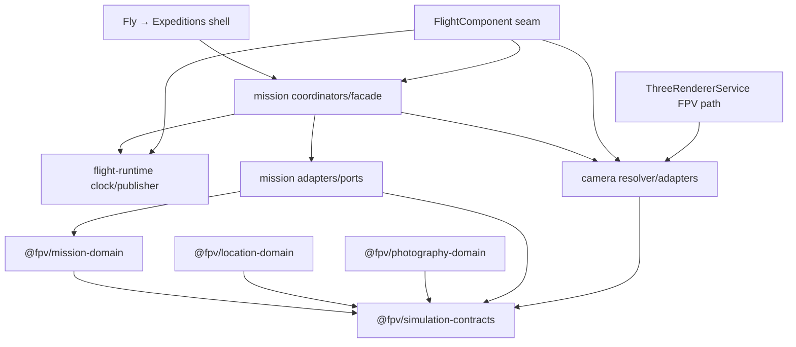
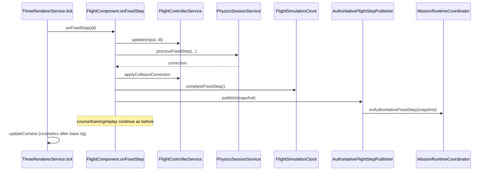
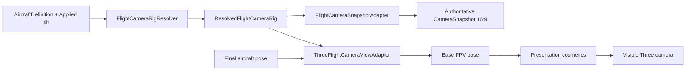
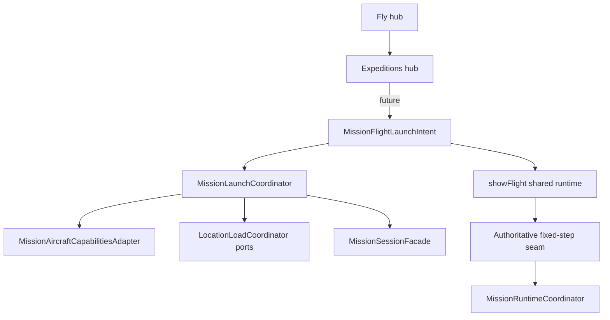
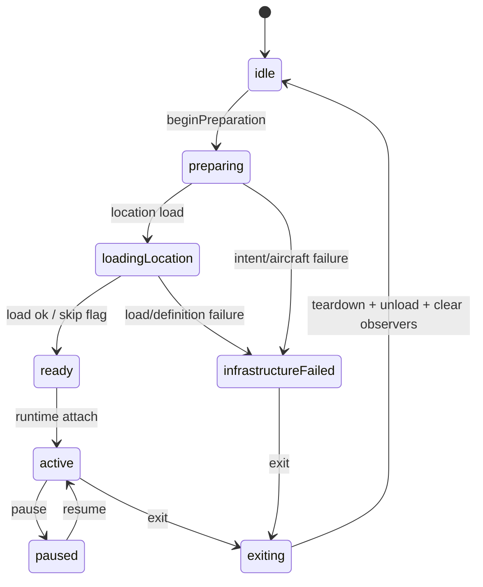

# FPV Simulator v1.3.0 — Checkpoint 3 Runtime Integration Foundations

**Milestone:** Curated Location and Photography Mission  
**Checkpoint date:** 2026-07-27  
**Feature branch:** `feature/v1.3.0-runtime-foundations`  
**Official starting baseline:** merged Checkpoint 2 (`bc14bede0edfc2224d579b5a41e6d41ee35c82a0`)  
**Prior checkpoints:**  
- [`v1.3.0-checkpoint-1-repository-audit.md`](./v1.3.0-checkpoint-1-repository-audit.md)  
- [`v1.3.0-checkpoint-2-domain-foundations.md`](./v1.3.0-checkpoint-2-domain-foundations.md)

This checkpoint wires Checkpoint 2 pure packages into the live Angular flight application through thin runtime seams, adapters, ports, and coordinators. It does **not** ship Mediterranean location assets, final mission content, screenshot scoring, persistence, or a full mission HUD.

---

## 1. Verified baseline

| Check | Result |
|---|---|
| Starting branch | `main` |
| Starting HEAD | `bc14bede0edfc2224d579b5a41e6d41ee35c82a0` |
| Merge subject | `Merge pull request #8 from AmjadGn/feature/v1.3.0-domain-foundations` |
| Worktree at start | Clean |
| Authoritative remote | `upstream` → `https://github.com/AmjadGn/fpv-trainer.git` |
| Feature branch | `feature/v1.3.0-runtime-foundations` |
| Preserved release | `v1.2.1` yaw-axis fix remains untouched |

Checkpoint 1 and Checkpoint 2 findings remain authoritative. This checkpoint does not re-audit them.

---

## 2. Files and packages changed

### Flight-runtime integration
- `src/app/core/flight-runtime/models/authoritative-flight-step-snapshot.ts`
- `src/app/core/flight-runtime/models/flight-runtime-session.ts`
- `src/app/core/flight-runtime/ports/flight-runtime-step.port.ts`
- `src/app/core/flight-runtime/services/flight-simulation-clock.service.ts`
- `src/app/core/flight-runtime/services/authoritative-flight-step-publisher.service.ts`
- `src/app/features/flight/flight.component.ts` (minimal fixed-step seam + lifecycle)

### Camera integration
- `src/app/core/camera/models/resolved-flight-camera-rig.ts`
- `src/app/core/camera/math/flight-camera-world-pose.ts`
- `src/app/core/camera/services/flight-camera-rig-resolver.service.ts`
- `src/app/core/camera/services/flight-camera-snapshot-adapter.service.ts`
- `src/app/core/camera/adapters/three-flight-camera-view.adapter.ts`
- `src/app/core/rendering/services/three-renderer.service.ts` (FPV path consumes canonical rig)

### Mission application integration
- `src/app/core/mission/models/*`
- `src/app/core/mission/ports/*`
- `src/app/core/mission/adapters/*`
- `src/app/core/mission/services/*`
- `src/app/core/shell/app-shell.service.ts` (`missions` view + `mission` launch intent)

### Shell / navigation
- `src/app/features/fly/fly-hub.component.ts` (Expeditions entry)
- `src/app/features/missions/expeditions-hub.component.ts`
- `src/app/app.ts`, `src/app/app.html`

### Tests
- Fixed-step / tick / publisher specs
- Camera resolver / world-pose / Three adapter specs
- Aircraft capability + snapshot adapter specs
- Launch-intent discrimination specs
- Mission coordinator specs
- Expeditions shell specs
- Engineering dependency-boundary specs

### Documentation
- This file

**Deviation from the illustrative tree in the brief:** camera lives under `src/app/core/camera/` (not nested under mission), and curated-location ports share `location-definition-source.port.ts` for definition/asset/runtime types. Naming matches repository conventions and Checkpoint 1/2 terminology.

Pure Checkpoint 2 packages were **not** modified.

---

## 3. Authoritative fixed-step order

Preserved live order from Checkpoint 1 / real `FlightComponent.onFixedStep`:

```text
prepare input (onBeforeSteps)
→ apply environmental inputs (wind)
→ integrate custom flight model (FlightControllerService.update)
→ synchronize Rapier body + step Rapier + process contacts
→ apply collision correction back to flight state
→ record post-physics velocity / damage visual stamp
→ ★ NEW: increment tick + publish AuthoritativeFlightStepSnapshot
→ course / training fixed updates (existing semantics preserved)
→ achievement / replay sample / renderer.applyFlightState
→ crash audio / scrape idle
→ (later, frame-only) updateCamera + HUD + render
```

Replay / course / training remain after the new seam so their existing semantics are unchanged. Mission observers see post-collision authoritative state.

---

## 4. Exact completed-step insertion point

File: `src/app/features/flight/flight.component.ts`  
Method: `onFixedStep` callback registered in `rebuildEnvironment()`  

Insertion: immediately after Rapier correction / `recordPostPhysicsVelocity`, **before** course/training/replay/renderer pose sync.

Helper: `publishAuthoritativeFixedStep(fixedDt, collisionOutcome)`.

Paused / not-ready / replay paths still early-return **before** the seam, so they do not produce completed ticks.

---

## 5. Tick ownership and lifecycle

**Owner:** `FlightSimulationClock` (`src/app/core/flight-runtime/services/flight-simulation-clock.service.ts`)

| Behavior | Rule |
|---|---|
| begin/reset session | `beginSession` / `resetSession` → tick `0`, new `sessionGeneration` |
| increment | exactly once via `completeFixedStep()` after correction |
| independence | no `Date`, no `performance.now`, no render-frame coupling |
| domain boundary | not mission-domain, not photography-domain, not physics constants |
| mount | `applySelectedAircraft()` begins a fresh session for each flight mount |

`AuthoritativeFlightStepPublisher` delegates increment + publish. Observers cannot replace flight state.

---

## 6. Authoritative aircraft snapshot

`AuthoritativeFlightStepSnapshot` contains only trusted runtime DTO fields:

- `simulationTick`, `fixedStepSeconds`, `sessionGeneration`
- pose, linear velocity, body angular velocity
- armed / crashed, altitude, speed
- aircraft id + source type (`factory` \| `user-compiled`)
- definition / physics profile versions
- collision outcome summary
- runtime compatibility version

Excluded: Angular signals, Three.js, Rapier handles, raw axes, calibration, screenshots, mission scores, wall-clock timestamps.

Adapter: `MissionAircraftSnapshotAdapter` validates finiteness and supports stale-generation detection.

---

## 7. Camera-rig resolution strategy

Canonical contract: `ResolvedFlightCameraRig`

Default strategy for v1.3.0 Checkpoint 3:

```text
legacy-renderer-compatible-v1
```

Uses the live renderer’s historical base values:

- mount `(0, 0.12, -0.18)`
- base FOV `75°`
- near `0.05` / far `900`
- tilt from `AppliedFlightConfig.fpvCameraTilt` (same as current `cfg.fpvCameraTilt`)
- mission capture aspect `MISSION_CAPTURE_ASPECT_RATIO` (`16/9`)

Also supports `aircraft-profile-v1` (explicit opt-in) and always records source-profile mismatch diagnostics when profile values differ from legacy.

One resolved rig is active per flight session via `FlightCameraSnapshotAdapter`.

---

## 8. Legacy camera parity

`ThreeFlightCameraViewAdapter` + `flight-camera-world-pose.ts` mirror the previous hardcoded FPV path using the same mount, tilt composition, and look-direction math as `flight-frame-sync.fpvLookDirection`.

Parity tests cover identity, yaw 90°, yaw 180°, legacy mount/FOV/tilt, and mission-aspect independence from viewport/DPR/shake.

---

## 9. Cosmetic-camera exclusion

Presentation-only effects remain frame-path only:

- camera shake / position offset
- look lag
- impact displacement
- cosmetic dynamic FOV offset

They are applied **after** the authoritative base pose inside `ThreeFlightCameraViewAdapter.applyFpvBaseThenCosmetics`.  
`FlightCameraSnapshotAdapter.buildSnapshot` never accepts cosmetics.

---

## 10. Factory / compiled aircraft capability mapping

`MissionAircraftCapabilitiesAdapter` maps `AircraftDefinition` → `MissionAircraftCapabilities` for both paths:

| Field | Mapping |
|---|---|
| sourceType | `user-build`/`compiled` tags → `user-compiled`, else `factory` |
| dimensions / mass / TWR / max speed | trusted definition fields |
| camera FOV capability | from `cameraProfile.fpv` when present |
| collision availability | parts array present |
| provenance | compiled → `template-derived` warnings; factory → `runtime` |
| endurance | **not invented** (`estimatedEnduranceMinutes` omitted) |
| controller / calibration | never mapped |

---

## 11. Mission launch-intent integration

`FlightLaunchIntent` extended with `MissionFlightLaunchIntent`:

```text
kind: 'mission'
missionId, locationId, aircraftId, aircraftSourceType
optional mission/location versions, spawnPointId, returnDestination
optional isolated developmentFlags
```

Validation rejects embedded definition/scene/Rapier/component payloads. Existing free / race / training / replay / test-flight intents remain valid. Mission flights reuse the shared `flight` shell view — no second runtime.

---

## 12. Fly → Expeditions shell integration

Product IA for v1.3.0:

```text
Fly
└── Expeditions   (internal AppView: 'missions')
```

- Expeditions entry added on Fly hub
- `AppShellService.showExpeditions()`
- Foundation screen with truthful empty copy:  
  **“Expedition content is not installed in this build.”**
- No new top-level primary-nav product
- No fake final mission cards or scores

---

## 13. Mission facade / coordinator responsibilities

| Component | Owns | Must not |
|---|---|---|
| `MissionSessionFacade` | lifecycle phase, identities, diagnostics, location progress | score photos, raycast, own Three/Rapier/flight loop |
| `MissionLaunchCoordinator` | intent validation, shared aircraft resolve, capabilities adapt, location load request | duplicate factory/compiled launch paths |
| `LocationLoadCoordinator` | definition lookup / validate / asset request / install / cancel / unload | construct production GLTF/collision packages |
| `MissionRuntimeCoordinator` | sync fixed-step observation, camera snapshot forward, stale rejection, exit teardown | final photography scoring, screenshots, persistence, own sim loop |

---

## 14. Curated-location ports

Ports (application-facing):

- `LocationDefinitionSourcePort`
- `LocationAssetLoadPort`
- `LocationRuntimeInstallPort`
- progress / failure DTOs

Checkpoint 3 ships **null adapters** that refuse to claim success. Failure never silently falls back to a legacy trainer environment while asserting the mission location loaded.

---

## 15. Spatial-query port

`MissionSpatialQueryPort` with plain DTO queries:

- `queryLineOfSight`
- `querySegmentObstructions`
- `queryVisibilitySamples`

`UnavailableMissionSpatialQueryAdapter` returns `status: 'unavailable'` with `unobstructed: null` — **never** “clear”.  
`RapierMissionSpatialQuerySkeleton` is a capability probe only.

---

## 16. Session teardown and stale-generation protection

Lifecycle covered:

- preparation / runtime reset / tick reset
- aircraft + camera-rig setup
- observer registration / teardown
- location generation / unload
- pause/resume facade phases
- retry via detach+attach (no duplicate observers)
- exit clears mission observers and facade state so free flight does not inherit mission state
- stale `sessionGeneration` callbacks reported as `STALE_RUNTIME_SESSION`

Angular flight teardown also clears publisher observers and camera rig.

---

## 17. Failure codes

Stable codes (presentation may map to strings):

- `MISSION_LAUNCH_INTENT_INVALID`
- `MISSION_DEFINITION_UNAVAILABLE`
- `LOCATION_DEFINITION_UNAVAILABLE`
- `LOCATION_VALIDATION_FAILED`
- `LOCATION_RUNTIME_LOAD_FAILED`
- `AIRCRAFT_INCOMPATIBLE`
- `AIRCRAFT_CAPABILITY_ADAPTER_FAILED`
- `CAMERA_RIG_RESOLUTION_FAILED`
- `SPATIAL_QUERY_UNAVAILABLE`
- `AUTHORITATIVE_STEP_OBSERVER_FAILED`
- `STALE_RUNTIME_SESSION`

Observer failure policy: catch + diagnose; continue peer observers; do not corrupt the flight loop.

---

## 18. Dependency direction



Rules enforced by engineering boundary tests:

- pure packages remain free of Angular / Three / Rapier / `src/app`
- mission feature components do not import Rapier or photography scoring APIs
- `FlightControllerService` does not import `@fpv/mission-domain`

---

## 19. Tests and validation

Focused new suites cover:

1. fixed-step / tick / publisher lifecycle  
2. camera resolver + authoritative pose + cosmetic exclusion  
3. factory/compiled capability adapter  
4. launch-intent discrimination  
5. mission coordinators / location unavailable / stale session / retry  
6. Expeditions shell / truthful empty state  
7. dependency boundaries  

Full commands (Checkpoint 3 completion):

```bash
npm run test:engineering
npm run test:ci
npm run build
```

---

## 20. Existing behavior preserved

- Free flight, training/course, Hangar test-flight, Builder compile-and-fly
- Controller calibration v2 / yaw polarity
- Flight physics constants and integration
- Replay, ghost, chase camera
- Resize / DPR presentation path (authoritative snapshots ignore them)
- No second RAF / flight / Rapier step loop

---

## 21. Exact scope for Checkpoint 4

Checkpoint 4 should implement **content + evaluation wiring**, not more runtime ownership:

1. First curated location definition package identity: **Mediterranean Expedition Region** (Coastal Ruins as subregion/area)
2. Real `LocationDefinitionSource` + asset/runtime install adapters (GLTF/collision) behind existing ports
3. First photography mission definition + validation via `@fpv/location-validation`
4. MissionRuntimeCoordinator → photography evidence construction from authoritative aircraft + camera snapshots
5. Rapier-backed `MissionSpatialQueryPort` implementation (no false-clear policy)
6. Mission briefing / active / results shell phases (still no second flight loop)
7. Capture trigger + evidence assembly (screenshot optional/non-authoritative)
8. Persistence schema design (`fpv-missions-v1`) — implement only after evidence contract is stable

---

## 22. Files expected to change in Checkpoint 4

- `packages/location-domain` content package(s) for Mediterranean Expedition Region
- `packages/mission-domain` / `photography-domain` content instances (not framework coupling)
- `src/app/core/mission/adapters/*` real location + Rapier spatial adapters
- `src/app/core/mission/services/mission-runtime-coordinator.service.ts` (evaluation hooks)
- `src/app/features/missions/**` briefing/browser/results foundations
- Possibly `PhysicsSessionService` read-only query façade
- Persistence module (new) once approved

Still forbidden unless separately approved: cloud multiplayer, tournaments, fake scores, rewriting flight physics.

---

## 23. Remaining risks and open decisions

### Risks (non-blocking for Checkpoint 3)

| Risk | Notes |
|---|---|
| Profile vs legacy camera mismatch | Default legacy strategy preserves feel; profile normalization still pending |
| Null location adapters | Correct refusal, but no playable expedition until Checkpoint 4 |
| FlightComponent still large | Seam is minimal; broader decomposition deferred |
| Replay clear-data key mismatch | Pre-existing; **not fixed** here (explicit exclusion) |

### Open decisions for Amjad

None required to start Checkpoint 4 on the locked Checkpoint 2 decisions. Optional product choices:

1. Whether Coastal Ruins is the first playable mission area inside Mediterranean Expedition Region, or a later subregion after a broader region hub.
2. Whether mission capture UI shows a 16:9 framing guide overlay in Checkpoint 4 or only uses it for scoring evidence.

---

## Mermaid diagrams

### Authoritative fixed-step flow



### Camera flow



### Mission launch flow



### Session lifecycle


