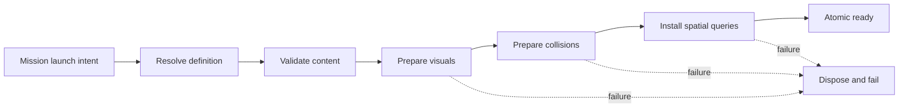
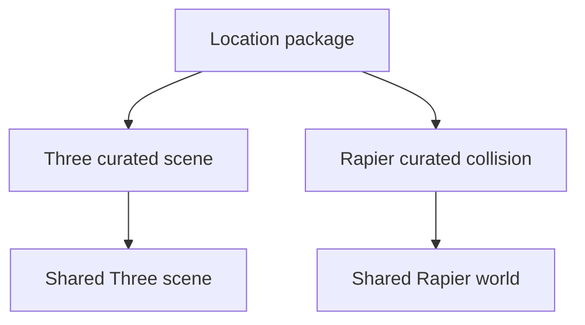
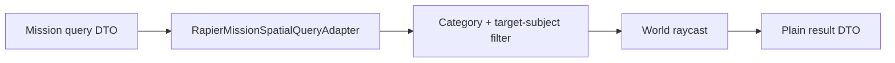
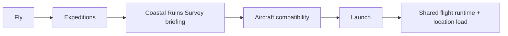

# FPV Simulator v1.3.0 — Checkpoint 4 Coastal Ruins Location Runtime

**Milestone:** Curated Location and Photography Mission  
**Checkpoint date:** 2026-07-27  
**Feature branch:** `feature/v1.3.0-coastal-ruins-location`  
**Official starting baseline:** merged Checkpoint 3 (`69fa6e35f153e28c4f408748e92e4403534cdaac` — PR #9)  
**Prior checkpoints:**  
- [`v1.3.0-checkpoint-1-repository-audit.md`](./v1.3.0-checkpoint-1-repository-audit.md)  
- [`v1.3.0-checkpoint-2-domain-foundations.md`](./v1.3.0-checkpoint-2-domain-foundations.md)  
- [`v1.3.0-checkpoint-3-runtime-integration-foundations.md`](./v1.3.0-checkpoint-3-runtime-integration-foundations.md)

This checkpoint delivers the first curated-location runtime vertical slice: **Mediterranean Expedition Region** with playable subregion **Coastal Ruins**, real load/collision/spatial-query adapters, Coastal Ruins Survey mission definition, Expeditions briefing/launch foundation, and a presentation-only 16:9 framing guide.

**Content status:** proxy-quality repository-owned geometry. Not final production art. Photography capture/scoring is **not** complete.

---

## 1. Verified baseline

| Check | Result |
|---|---|
| Starting branch | `main` |
| Starting HEAD | `69fa6e35f153e28c4f408748e92e4403534cdaac` |
| Merge subject | `Merge pull request #9 from AmjadGn/feature/v1.3.0-runtime-foundations` |
| Worktree at start | Clean |
| Authoritative remote | `upstream` → `https://github.com/AmjadGn/fpv-trainer.git` |
| Feature branch | `feature/v1.3.0-coastal-ruins-location` |
| Preserved release | `v1.2.1` yaw-axis fix untouched |

Checkpoint 1–3 findings remain authoritative.

---

## 2. Location package identity / version

| Field | Value |
|---|---|
| Package ID | `mediterranean-expedition-region` |
| Display name | Mediterranean Expedition Region |
| Package version | `1.0.0` |
| Schema version | `1.0.0` |
| Compatibility version | `1.0.0` |
| Runtime min compatibility | `1.0.0` |
| Coordinate system | `SIMULATOR_COORDINATE_SYSTEM_V1` (`1.0.0`) |
| Authored seed | `0x4D455249` (`MERI`) |
| Quality tiers | `low` / `medium` / `high` |
| Provenance | repository-owned proxy; fictionalized Mediterranean inspiration |

---

## 3. Coastal Ruins subregion identity

Coastal Ruins is **not** a competing top-level package. It is:

- subregion ID: `coastal-ruins`
- mission zone: `zone-coastal-ruins-mission`
- landmark / objective cluster inside the Mediterranean package

---

## 4. Authored proxy layout

Deterministic primitive layout (fixed seed):

- coastal cliff edge
- open sea-facing flight space
- ruined stone walls
- stone sea arch (opening remains clear)
- ruined lookout tower
- elevated photography vantage
- narrow rock passage
- low-altitude shoreline route
- safe spawn + restart
- hard / soft-warning / playable AABB boundaries

Decorative rock density scales by quality tier only. Collision, spawns, subjects, and zones do not.

---

## 5. Package structure

```text
src/app/content/locations/mediterranean-expedition-region/
  identity.ts / layout.ts / assets.ts / subjects.ts / spatial.ts
  provenance.ts / package.ts / presentation.ts / collision-descriptors.ts
  missions/coastal-ruins-survey.ts
  missions/photography-objectives.ts
```

Serializable, versioned, domain-validated via `@fpv/location-validation`.

---

## 6. Registry

- `CuratedLocationRegistry` — installed packages; rejects duplicates and `fallback-flat`
- `BundledLocationDefinitionSource` — lookup / getDefinition / listInstalled

---

## 7–9. Loading pipeline, atomic install, cancel/retry



Stages: `resolving` → `validating` → `loadingVisuals` → `loadingCollisions` → `installingQueries` → `finalizing` → `ready` (plus cancel/unload/fail).

Cancellation uses AbortSignal + load generation. Stale completions are rejected. Unload is idempotent.

---

## 10–11. Three / Rapier adapters

- `ThreeCuratedLocationSceneAdapter` — proxy meshes, landmark groups, dispose geometries/materials
- `RapierCuratedLocationCollisionAdapter` — static boxes into **existing** Rapier world; does not step; does not create a second world
- Previous trainer environment collisions are **reversibly suspended** (not permanently cleared) during curated install; trainer visuals hidden while curated is active; unload restores the suspended collision set

> **Original Checkpoint 4 review finding:** the first implementation called `clearRegisteredBodiesKeepingDrone()` before curated install completed and restored trainer *visual* visibility on failure/unload without restoring the previous collision bodies. That violated atomic install, unload, and free-flight regression guarantees. Corrected below.



---

## 12–14. Visual/collision separation, categories, spatial queries

Visual asset ids never appear as collision authority. Categories map to existing `CollisionGroup` bitmasks (`TERRAIN`, `STATIC_STRUCTURE`, …).

Authoritative subject colliders carry `subjectId` / `queryTargetId` ownership metadata (arch → `subject-stone-sea-arch`, tower → `subject-ruined-lookout`, cliffside → `subject-cliffside-ruin`). Terrain/walls/rocks/boundaries have no subject id.

`RapierMissionSpatialQueryAdapter` implements:

- `queryLineOfSight`
- `querySegmentObstructions`
- `queryVisibilitySamples`

Default LOS ignores drone, sensors, decorative; includes terrain/static/**all** subject geometry. When `targetSubjectId` is supplied, only that subject's colliders are ignored. When no target is supplied, behavior is conservative (subject geometry can obstruct). Unavailable/stale never means clear.



---

## 15–17. Subjects, mission, aircraft compatibility

Subjects:

1. `subject-stone-sea-arch`
2. `subject-ruined-lookout`
3. `subject-cliffside-ruin`

Mission: `coastal-ruins-survey` — Coastal Ruins Survey — three sequential photography objectives, no hard time limit, optional time bonus, crash + OOB grace policy, no endurance constraint. Recommended: cinewhoop / hybrid / micro. Prohibited: `long-range-7inch`. Compiled aircraft template-derived camera/collision → warnings.

---

## 18. Expeditions launch flow



Exact selected aircraft is preserved. Capture scoring truthfully reported as not enabled.

---

## 19. Framing guide

`MissionFramingGuideComponent` — centered 16:9 CSS geometry, letterbox/pillarbox, pointer-events disabled, presentation-only.

Shipping rule: the framing guide is visible only while a photography objective is active (`photographyObjectiveActive`). Checkpoint 4 does not yet contain complete objective runtime, so that signal remains false during normal mission flight. An explicit development preview flag may show the guide. Mission session `missionActive` is **not** used as the guide's active input.

---

## 20–21. Lifecycle, diagnostics, validation

Lifecycle: unloaded → resolving → validating → loadingVisuals → loadingCollisions → installingQueries → ready → unloading → unloaded.

`LocationRuntimeDiagnosticsService` reports object/collider/query readiness (non-authoritative).

Failure codes include `LOCATION_PACKAGE_NOT_FOUND`, `LOCATION_CONTENT_INVALID`, `LOCATION_COLLISION_BUILD_FAILED`, `LOCATION_QUERY_INSTALL_FAILED`, `LOCATION_PREVIOUS_COLLISION_RESTORE_FAILED`, `LOCATION_LOAD_CANCELLED`, `STALE_LOCATION_GENERATION`, `MISSION_CAPTURE_NOT_ENABLED`, etc.

---

## 22–23. Tests and preserved behavior

Focused suites cover package validation, registry, load lifecycle, Three adapter, spatial unavailable semantics, **live Rapier LOS / target-subject filtering**, **collision suspension/restore + curated install rollback**, mission definition/compatibility, Expeditions, framing geometry, mission activation timing, dependency boundaries.

Preserved: free flight, training/course, Hangar, Builder, controller calibration v2, yaw axis fix, fixed-step seam, canonical camera, chase, replay, ghost.

---

## 24. Known proxy-content limitations

- Primitive boxes / planes — not production art
- No external assets / photogrammetry / map downloads
- No screenshot capture or scoring loop
- Boundary grace failure loop not fully productized

---

## 25. Exact Checkpoint 5 scope

1. Photography capture shutter / evidence construction from authoritative aircraft + camera snapshots  
2. Deterministic scoring runtime wired to mission objectives  
3. Objective completion / sequencing in mission session  
4. Photography HUD feedback (not fake results)  
5. Mission results presentation (non-persistent or persistence if approved)  
6. Keep location adapters thin — no second flight/physics loops  

## 26. Expected Checkpoint 5 files

- `src/app/core/mission/services/photography-capture.coordinator.ts` (or equivalent)
- evidence adapters from flight + camera snapshots
- scoring observer hooked after spatial queries
- photography HUD components under `features/missions`
- results shell view foundation
- tests for capture → score → complete

## 27. Remaining risks / open decisions

- Persistence of best scores / screenshots (product decision — **deferred to Checkpoint 6**)
- Whether framing guide stays always-on for photo objectives in shipping builds (Checkpoint 5 objective runtime)
- Final art pipeline for Mediterranean region
- Deferred pre-existing: replay clear-data key mismatch (untouched)

---

## 28. Review corrections (post Checkpoint 4 architecture review)

Architecture review found required correctness gaps after the functional Checkpoint 4 slice. Corrections:

### 1. Reversible previous-environment collision ownership

`PhysicsWorldService` now exposes:

- `suspendRegisteredBodiesKeepingDrone()` → opaque `SuspendedEnvironmentCollisionHandle`
- `restoreSuspendedBodies(handle)`
- `discardSuspendedBodies(handle)`

Snapshots preserve body ids, definitions, poses, body type, material, collision groups, sensor state, and dynamic/static configuration. Rapier handles stay inside physics infrastructure. Restore order is deterministic by body id. Double restore is rejected; unload clears ownership so repeated unload is idempotent without duplicating bodies.

After bulk collider mutations, `PhysicsWorldService.refreshSceneQueries()` performs a **zero-timestep** world update so scene queries see new colliders immediately. This is physics-infrastructure refresh, not a second flight fixed-step seam and not a location-adapter simulation step.

### 2. Exact rollback lifecycle

Install ordering:

1. Build curated proxy visuals (previous collisions remain active)
2. Suspend previous non-drone bodies
3. Install curated visuals / hide trainer visuals
4. Install curated colliders + spatial queries
5. Commit (retain suspension handle)

On failure/cancel/stale after suspension: remove curated colliders → restore previous bodies → dispose curated visuals → show trainer visuals → return failure.

There is no exit path that leaves both collision runtimes absent after suspension begins.

### 3. Restored collision-state guarantees

Unload ordering:

1. Uninstall spatial query
2. Remove curated colliders
3. Restore previous collision bodies (exactly once)
4. Dispose curated visuals
5. Show trainer visuals
6. Clear diagnostics

Restoration failure emits `LOCATION_PREVIOUS_COLLISION_RESTORE_FAILED` and is **not** reported as a successful unload. Free-flight collisions survive an Expedition round trip. Re-showing trainer visuals alone does not restore physics.

### 4. Target-specific subject filtering

LOS/visibility ignore only colliders whose authored `subjectId` matches `targetSubjectId`. Other subject geometry remains capable of obstructing. Ownership is authored metadata — not body-name substring matching during the query.

### 5. Conservative no-target LOS behavior

When `targetSubjectId` is omitted, subject geometry is included as possible obstruction (no blanket `subject-geometry` ignore).

### 6. Endpoint / target filtering policy

Primary policy: exclude the target subject's authored colliders when `targetSubjectId` matches. Documented endpoint epsilon constant `MISSION_LOS_ENDPOINT_EPSILON_METERS` (`1e-3`) supports terminating on the target surface without a large arbitrary distance tolerance. Hit ordering remains deterministic (`toi`, then category).

### 7. Real Rapier test coverage

Integration tests initialize a real Rapier world (no WebGL/screenshots) and exercise clear/obstructed segments, arch opening vs pillar, cross-subject obstruction, drone/sensor/decorative ignores, stale/unavailable semantics, deterministic DTO equality, visibility samples, suspension/restore, and curated install rollback paths.

### 8. Truthful mission activation

`missionActive` becomes true only after launch validation, aircraft compatibility, location validation, curated visual/collision/query install, spawn reset, and mission runtime observer attach succeed. Failures/cancellations leave `missionActive` false with no remaining observer. Stale async completion after teardown cannot reactivate the mission.

### 9. Framing guide remains preview-only until Checkpoint 5

`photographyObjectiveActive` stays false in Checkpoint 4 shipping flight. Guide visibility = objective active **or** explicit development preview. Do not claim objective capture is active before Checkpoint 5.

### 10. Persistence remains deferred to Checkpoint 6

No IndexedDB mission stores, best-score persistence, screenshot persistence, or mission progress persistence in this correction.

---

## Runtime guarantees

- No second flight loop / RAF loop / Rapier world
- Location adapters do not step physics
- Visual and collision content are separate
- Visual and collision runtime remain synchronized across curated install/unload
- Unavailable spatial query ≠ clear LOS
- Exact selected aircraft preserved
- Free flight remains operational after Expedition exit
