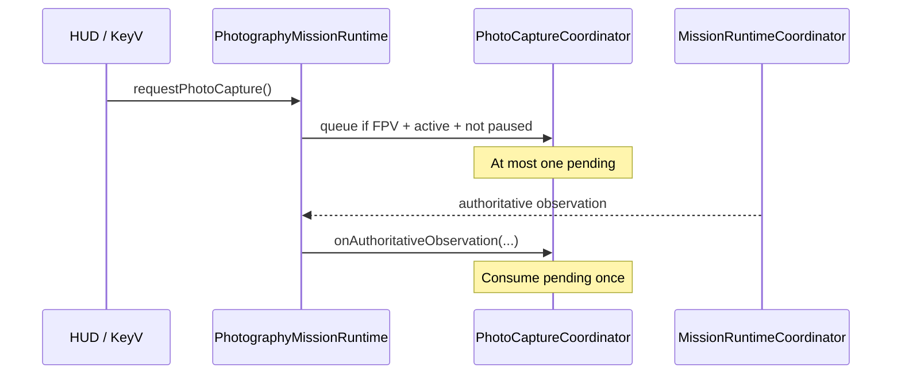
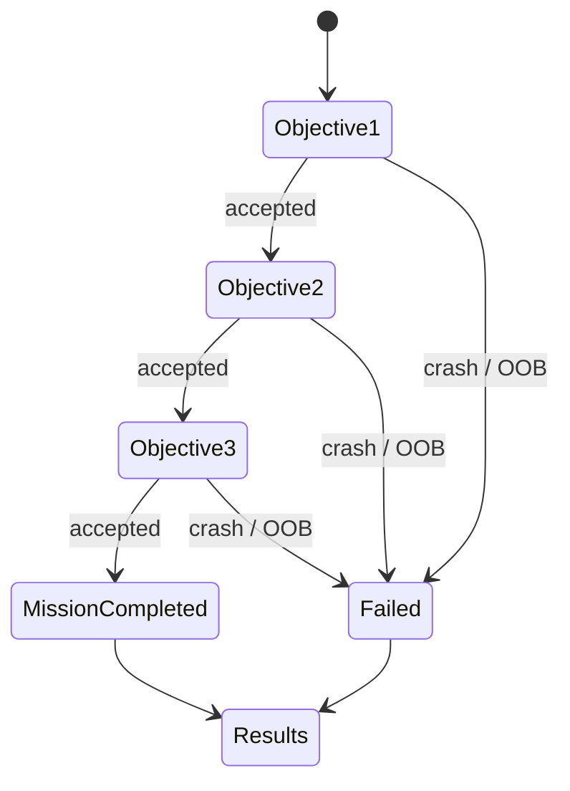
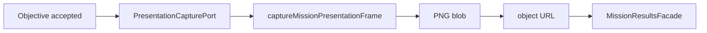
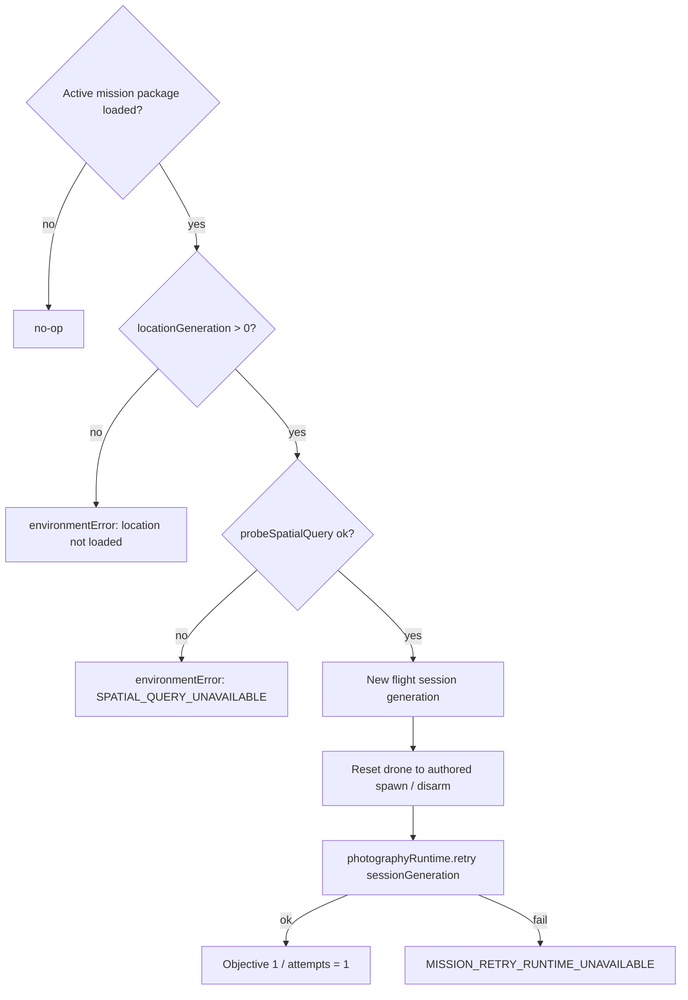
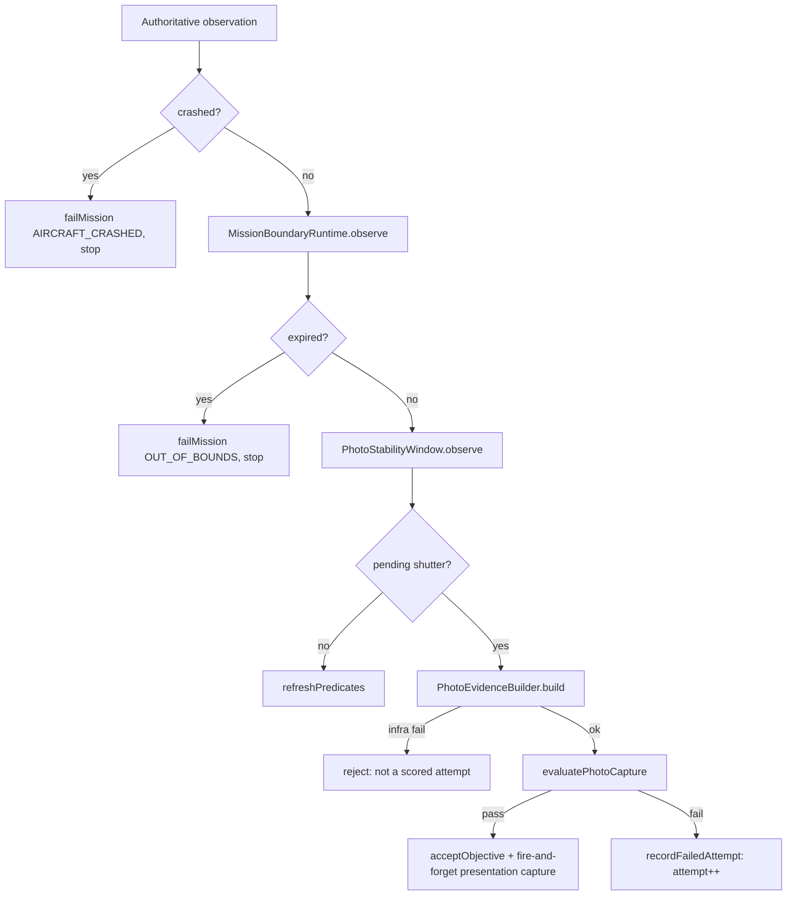

# FPV Simulator v1.3.0 — Checkpoint 5 Photography Mission Loop

**Milestone:** Curated Location and Photography Mission  
**Checkpoint date:** 2026-07-27  
**Baseline commit:** `14edde7` (`Merge pull request #10 from AmjadGn/feature/v1.3.0-coastal-ruins-location`)  
**Branch:** `feature/v1.3.0-photography-mission-loop`  
**Prior checkpoint:** [`v1.3.0-checkpoint-4-coastal-ruins-location-runtime.md`](./v1.3.0-checkpoint-4-coastal-ruins-location-runtime.md)

This checkpoint delivers the complete Coastal Ruins photography capture loop:
authoritative shutter consumption, evidence construction, scoring, objective
progression, crash/bounds failure, session-only results HUD, presentation
frames, and fast retry without location reload. No IndexedDB / progress
persistence (Checkpoint 6).

---

## 1. Baseline

| Check | Result |
|---|---|
| Baseline SHA | `14edde792a7e03474210c7bee16aaa0c5c7ffd80` |
| Merge subject | `Merge pull request #10 from AmjadGn/feature/v1.3.0-coastal-ruins-location` |
| Feature branch | `feature/v1.3.0-photography-mission-loop` |
| Prior checkpoint | Checkpoint 4 (Coastal Ruins location runtime; capture/scoring explicitly not complete there) |
| Pinned toolchain | Node `22.22.3` / npm `10.9.8` (`package.json#engines`) |

Checkpoint 1–4 findings remain authoritative; this checkpoint does not revisit
location, collision, or catalog decisions except where the photography loop
needed a new seam (`objectiveScoreAllocation`, boundary-shape geometry export).

---

## 2. Service map

| Service / port | Role |
|---|---|
| `PhotographyMissionRuntime` | Orchestrates the loop; owns one observation listener |
| `MissionObjectiveRuntime` | FSM + objective sequencing + authored point budgets |
| `PhotoCaptureCoordinator` | At-most-one pending shutter; consume on fixed step |
| `PhotoEvidenceBuilder` | Builds immutable `PhotoCaptureEvidence` |
| `PhotoStabilityWindow` | Contiguous stable-tick gate (pure) |
| `MissionBoundaryRuntime` | Out-of-bounds grace countdown (pure) |
| `MissionResultsFacade` | Session-only results VM + object URL ownership |
| `MissionPhotoPresentationCapturePort` | Presentation-only frame seam |
| `ThreeMissionPhotoPresentationCaptureAdapter` | Browser Three.js adapter |
| `NullMissionPhotoPresentationCaptureAdapter` | SSR/test null adapter |
| `ThreeRendererService.captureMissionPresentationFrame` | One-shot 1280×720 offscreen render |
| `FlightComponent` | Begin/pause/shutter/HUD/results/retry/exit only |

Angular UI never allocates scores, projects subjects, or queries Rapier.

---

## 3. Shutter command queue



Repeated presses while pending return `PHOTO_CAPTURE_ALREADY_PENDING` and do
not increment the attempt counter.

---

## 4. Authoritative capture timing

Capture is consumed on the **next completed authoritative fixed step** after
the shutter is accepted. Evidence uses that step’s flight + cosmetics-free
camera snapshot. No wall clock, no RAF, no interpolated pose.

---

## 5. Stability policy

`PhotoStabilityWindow` counts contiguous ticks where:

- `linearSpeed <= maxLinearSpeedMps` (inclusive)
- `bodyAngularSpeed <= maxBodyAngularSpeedRadps` (inclusive)

Thresholds and `stabilityDurationTicks` come from the active photography
objective. Tick gaps, session/objective changes, and speed breaches reset the
run. Pause is implemented by **not observing**, which surfaces as a gap.

---

## 6. Angular velocity convention

Flight snapshots store named body-frame rates `{ pitch, yaw, roll }` (rad/s).

Evidence `Vec3` mapping (matches `angularToReplay` / quat-math axes):

```text
x = pitch   (body +X; ω_x = −pitch)
y = yaw     (body +Y; ω_y = −yaw)
z = roll    (body −Z forward; ω_z = −roll)
```

This is **not** aerospace `[roll, pitch, yaw]`. Stability magnitude uses
`Math.hypot(pitch, yaw, roll)` on the named rates directly so a mapping
mistake cannot silently change the speed gate.

---

## 7. Boundary grace conversion

Approved grace duration: **3 continuous seconds**.

- Authored `graceTicks: 180` is a **60 Hz compatibility encoding** of 3 s.
- Runtime: `graceSeconds = authoredGraceTicksToSeconds(graceTicks)` then
  `graceTicks = ceil(graceSeconds / fixedStepSeconds)`.
- Ceiling ensures grace is never shorter than 3 s.
- At 60 Hz → 180; at 120 Hz → 360; at 30 Hz → 90.
- Fixed-step changes recompute ticks and **reset** the continuous count.
- Pause does not advance grace; re-entry resets; tick gaps reset; expiry
  fires exactly once.
- HUD `remainingSeconds = remainingTicks * fixedStepSeconds` (not wall clock).

---

## 8. Evidence construction

`PhotoEvidenceBuilder` fills Checkpoint 2 `PhotoCaptureEvidence`:

- Identity: schema version, capture id, objective id, session attempt id,
  attempt number, authoritative tick
- Aircraft: id, pose, linear/body angular velocity, altitude, armed, crashed,
  optional position zone
- Camera: world pose, projection (FOV/aspect/near/far/version), mode, cosmetics excluded
- Spatial: LOS / obstruction ratios, optional primary distance
- Subjects: deterministic order, rectangle, centering, coverage, intersection,
  distance, angle, side, visibility ratio
- Stability: stable/required ticks, `isStable`

Immutable, JSON-serializable, free of Angular signals / Three / Rapier /
screenshot pixels. Identical inputs ⇒ byte-identical `JSON.stringify`.

---

## 9. Spatial-query integration

Visibility comes only from `MissionSpatialQueryPort`, injected optionally and
falling back to `UnavailableMissionSpatialQueryAdapter` (never fabricates
"clear" line of sight); the production binding is
`RapierMissionSpatialQueryAdapter` via `provideMissionLocationRuntime()`.
Unavailable/stale queries fail with `PHOTO_CAPTURE_SPATIAL_UNAVAILABLE`
(infrastructure — does not count as a scored attempt). Position-zone and
boundary containment both use `pointInBoundaryShape` from
`@fpv/location-validation`, the same geometry authored-content validation
uses, so runtime and validation can never diverge on "inside".

---

## 10. Scoring integration

`evaluatePhotoCapture` from `@fpv/photography-domain` scores evidence against
the objective + scoring policy. Presentation capture runs **after** a pass and
cannot change the score.

---

## 11. Authored score allocation

`ScoreAggregationPolicy.objectiveScoreAllocation` (version `1.0.0`) authors
required-objective weights. Coastal Ruins:

```text
weights: arch=1, lookout=1, cliff=1
availablePoints = maxScore 100 − timeBonus 15 = 85
largest-remainder → 29 + 28 + 28
perfect + time bonus = 100
perfect without time bonus = 85 (not clamped to 100)
```

Rounding policy (Hamilton / largest remainder): floor each exact share, then
distribute leftover +1 by largest fractional part; ties keep authored order.
`scorePointsFromNormalized` uses `Math.round(n * maxPoints)` clamped to
`[0, maxPoints]`. The general runtime never hardcodes “three objectives”.

---

## 12. Objective attempts

```text
first capture attempt = 1
failed (player-caused) capture increments next attempt
accepted capture freezes its attempt number
next objective starts at attempt 1
retry resets all objectives to attempt 1
captureId = <session-id>:<objective-id>:<attempt-number>
```

Deduped shutter presses do not increment. Infrastructure failures
(spatial/evidence/scoring throw before a player verdict) do not count as
scored attempts.

---

## 13. Objective progression



Sequential order follows `grouping.requiredObjectiveIds`.

---

## 14. Crash and bounds failure

**Crash:** fail once (`AIRCRAFT_CRASHED`), clear pending shutter, disable
capture, keep location loaded, retry available.

**Bounds:** warning during grace with remaining ticks/seconds; re-entry clears
warning; after continuous grace expiry fail once (`OUT_OF_BOUNDS`). No hard
mission timeout for Coastal Ruins.

---

## 15. Pause behavior

While paused: no shutter consumption, no stability accumulation, no bounds
accumulation, no gameplay elapsed advancement via observations. Framing guide
hidden / shutter disabled via `photographyObjectiveActive`.

---

## 16. Framing-guide activation

`photographyObjectiveActive` is true only when mission runtime is active, the
current objective is photography, camera is FPV, not paused, not
failed/completed, and results are not open. Checkpoint 4
`missionFramingPreview` remains an isolated development flag.

---

## 17. Presentation image path



1280×720, authoritative camera snapshot, cosmetics-free. Failure →
`PHOTO_PRESENTATION_CAPTURE_FAILED` only; score unchanged.

---

## 18. Renderer-state restoration

`captureMissionPresentationFrame` preserves/restores in `try/finally`:

- render target, viewport, scissor, scissor-test, auto-clear
- clear color/alpha, XR enabled flag, drone visibility
- temporary camera + render target disposed
- exactly one explicit `render`, no second RAF
- live camera never permanently mutated

---

## 19. Stale callback handling

`PhotoCaptureCoordinator` bumps `presentationEpoch` on `reset()`. In-flight
presentation promises that complete after retry/exit revoke any URL and do not
attach. Replacing an image revokes the previous URL. One accepted image per
objective.

---

## 20. HUD

`MissionPhotographyHudComponent` shows mission title, objective index/total,
objective title, target name, shutter + `V` hint, pending state, attempt,
feedback, concise score breakdown, bounds warning/countdown, elapsed time,
accepted confirmation. No DTO dumps.

---

## 21. Results

`MissionSessionResultsComponent` shows completed/failed, total/max/normalized
score, time bonus, elapsed duration, per-objective results, session-only
presentation image or placeholder, Retry, Return to Expeditions. No best
score, saved status, medals, or leaderboard.

---

## 22. Fast retry



Three independent guards precede the retry (no active package, location not
loaded, spatial query unavailable); each fails visibly via `environmentError`
and never reloads content. Location generation is unchanged: no definition
lookup, asset load, Three group rebuild, or collider reinstall.
`MissionRuntimeCoordinator.prepareRetry` detaches and reattaches its single
subscription under the new session generation (never duplicated).
`PhotographyMissionRuntime.retry` clears attempt/result state, rebinds the
boundary countdown and stability window, clears the pending shutter, and
revokes prior presentation URLs via `MissionResultsFacade.clear()`.

---

## 23. Exit lifecycle

Two call sites reach the same core teardown: the pilot-initiated
`onMissionExit()` (returns to Expeditions) and `FlightComponent.teardown()`
(component destroy / navigating away entirely). Both call, in order:

1. `photographyRuntime.exit()` — clears the pending shutter, revokes
   presentation URLs (`results.clear()`), detaches the fixed-step listener,
   resets the stability window and boundary runtime, resets
   `MissionObjectiveRuntime`, and clears local session/context state.
2. `missionRuntimeCoordinator.exitAndTeardown()` — marks exiting, detaches the
   authoritative-step subscription, clears active camera rig, unloads the
   curated location, resets the session facade.

`onMissionExit()` additionally clears component-local mission fields
(package, spawn pose, subject names, title, shutter notice) and calls
`shell.showExpeditions()`. `teardown()` additionally increments
`missionPrepareGeneration` (invalidating any in-flight async mission prepare)
and runs the generic flight-session teardown (audio, replay, physics session,
renderer disposal).

---

## 24. Memory and URL cleanup

`MissionResultsFacade.clear()` / `revokeAllPresentationImages()` revoke every
retained object URL. Stale presentation completions also revoke. Safe under
SSR (no-op when `URL.revokeObjectURL` is absent).

---

## 25. Session-only limitation

Results, attempts, and presentation images exist for the current session only.
No IndexedDB, localStorage, personal bests, or cloud sync in Checkpoint 5.

---

## 26. Test results

| Suite | Pre-CP5 | Post-CP5 |
|---|---|---|
| `npm run test:engineering` | 562 | **630** |
| `npm run test:ci` | 606 | **763** |
| `tsc` app/spec | clean | clean |
| `npm run build` | — | successful |
| Node / npm | — | `22.22.3` / `10.9.8` (pinned) |

Focused new coverage includes: `score-allocation.spec.ts`,
`checkpoint-5-angular-velocity.spec.ts`, `checkpoint-5-boundary-runtime.spec.ts`,
`checkpoint-5-bounds-crash.spec.ts`, `checkpoint-5-bounds-crash-runtime.spec.ts`,
`checkpoint-5-dependency-boundaries.spec.ts`,
`checkpoint-5-hud-presentation.spec.ts`, `checkpoint-5-stability-window.spec.ts`,
`mission-objective-runtime.spec.ts`, `mission-results.facade.spec.ts`,
`checkpoint-5-photo-evidence.spec.ts`, `checkpoint-5-photo-shutter-queue.spec.ts`,
`checkpoint-5-scoring-objectives.spec.ts`, `checkpoint-5-retry-presentation.spec.ts`,
`photo-capture-coordinator.spec.ts`, `photography-mission-runtime.spec.ts`,
plus HUD/results component specs and the null presentation adapter.

---

## 27. Exact Checkpoint 6 persistence scope

Nothing in Checkpoint 5 persists. Concretely, today:

- `MissionResultsFacade` is explicitly session-only by design (see its module
  doc): no IndexedDB, no localStorage, no personal-best tracking. `clear()` /
  `revokeAllPresentationImages()` are the only "cleanup", not a save path.
- `sessionId` is generated as `mission-${missionId}-${Date.now()}` at launch —
  not a stable identifier suitable for a persisted record key.
- Presentation images are ephemeral `blob:` object URLs; nothing encodes them
  to a durable format or uploads them anywhere.
- Attempt counts, failed-attempt history, and accepted evaluations live only
  in `MissionObjectiveRuntime`'s in-memory maps and are dropped on `reset()`.
- The mission's `resultsMetadata.customResultsNote` for Coastal Ruins already
  tells the pilot results are session-only, i.e. authored content anticipates
  this changing later without committing to how.

This document does not specify what Checkpoint 6 persists, where, or in what
schema — that is Checkpoint 6's own design work. Whatever it adds must not
change Checkpoint 5's authoritative capture timing, scoring math
(`evaluatePhotoCapture`), or the score-allocation contract
(`objectiveScoreAllocation` / `allocateRequiredObjectiveMaxPoints`) without an
explicit version bump on those contracts.

---

## 28. Remaining risks

| Class | Notes |
|---|---|
| Non-blocking | Presentation capture quality depends on live scene state at capture time |
| Non-blocking | Session id currently uses wall-clock for uniqueness (not scoring) |
| Deferred CP6 | Persistence, bests, medals, leaderboards |
| Pre-existing deferred | Broader expedition catalog beyond Coastal Ruins |

---

## Capture / evidence / scoring pipeline



This mirrors `PhotographyMissionRuntime.onObservation`'s actual short-circuit
order: a crash or boundary expiry ends the step before stability or capture
consumption ever run.
