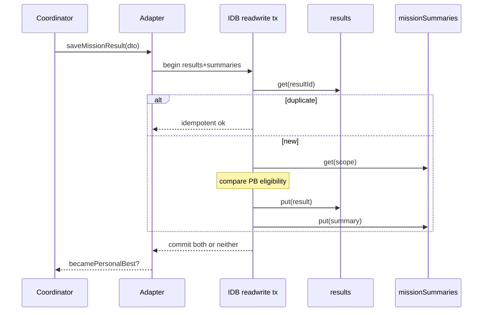
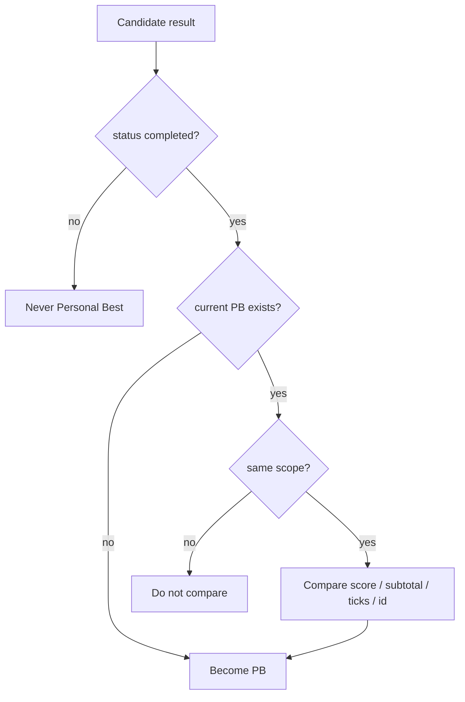
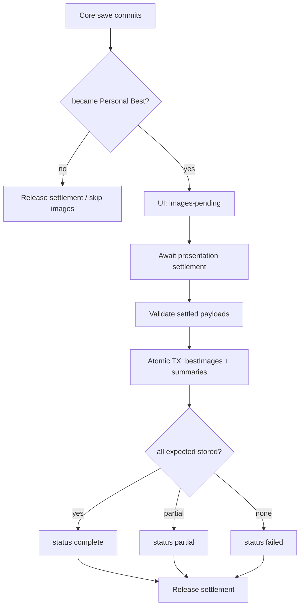
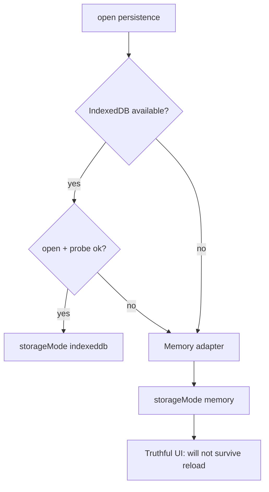

# Checkpoint 6 — Durable Mission Persistence

## 1. Verified post-PR-11 baseline

Squash-merged Checkpoint 5 into `main`:

- PR #11: `feat(v1.3.0): complete Coastal Ruins photography mission loop`
- Squash commit: `8dd934d0c74a82c0bcf1883280813763ab8a22dd`
- Reviewed head before squash: `acac032a71133d2fa1d60dc08aeeb7b7ec121b9a`
- Validation at merge: Node `22.22.3`, engineering `650` passed, application CI `770` passed, production build successful

Preserved from Checkpoint 5:

- Evidence Schema `2.0.0`
- Subject-bounds framing (`projectSubjectBounds`)
- Visibility sample LOS
- Capture IDs with session generation
- Yaw Axis Fix / controller calibration v2
- No second flight loop / RAF / Rapier world

## 2. Database name and version

```text
Database name: fpv-missions-v1
Database version: 1
```

Local-only IndexedDB. Not shared with `fpv-drone-builder-v1`, replay localStorage, or settings.

## 3. Pure persistence package

`@fpv/mission-persistence` (`packages/mission-persistence/`) is pure TypeScript.

Allowed: `@fpv/mission-domain`, `@fpv/photography-domain`, `@fpv/simulation-contracts` (indirect via types only as needed).

Forbidden: Angular, IndexedDB, Three.js, Rapier, Blob, object URLs, DOM, `src/app`.

## 4. Persisted DTOs

- `PersistedMissionResultRecord`
- `PersistedMissionObjectiveRecord`
- `PersistedMissionSummaryRecord`
- `PersistedBestImageManifestEntry` (metadata only; binary stays in adapters)
- `MISSION_PERSISTENCE_SCHEMA_VERSION = '1.0.0'`

## 5. Mission scope key

```text
<mission-id>@<mission-version>#<scoring-policy-version>
```

Example: `coastal-ruins-survey@1.0.0#1.0.0`

Different mission or scoring-policy versions never compete for Personal Best.

## 6. Stores and indexes

| Store | Key | Indexes |
|---|---|---|
| `results` | `resultId` | `missionScopeKey`, `savedAtEpochMs`, compound `missionScopeKey_savedAt` |
| `missionSummaries` | `missionScopeKey` | — |
| `bestImages` | `<scope>:<objectiveId>` | `missionScopeKey`, `personalBestResultId` |

`bestImages` stores an ArrayBuffer binary payload in the application adapter (converted to Blob only when creating presentation object URLs). Binary data never enters `@fpv/mission-persistence`.
| `metadata` | `key` | — |

## 7. Atomic core save transaction



Image Blobs are **not** written inside this transaction.

## 8. Personal Best comparator

Only `status === 'completed'` is eligible.

Order:

1. higher `totalScore`
2. higher `requiredObjectiveSubtotal`
3. lower `elapsedTicks`
4. lexicographically smaller `resultId`

`savedAt` is ignored. Failed results update history/attempt stats only.



## 9. Retention

- Keep latest **20** results per scope (`MISSION_RESULTS_RETENTION_LIMIT`)
- Always pin current Personal Best
- History sort: `savedAtEpochMs` desc, then `resultId`
- Other scopes unaffected

## 10. Image persistence flow



Image Blobs are **not** written inside the core result transaction.

## 11. Partial image failure

- Result and Personal Best remain valid
- Partial new records cleaned / replaced set is authoritative
- Status becomes `partial` or `failed`
- Diagnostic: `MISSION_BEST_IMAGES_PERSIST_FAILED`
- Stale old images are never shown for the new best

## 12. Memory fallback



When an IndexedDB transaction fails after open, the write reports failure diagnostics (`WRITE_FAILED` / `TRANSACTION_ABORTED` / `QUOTA_EXCEEDED`) and remains retryable with the same result ID. The coordinator does **not** automatically switch an already-open IndexedDB database to memory. Permanent open failure switches to memory for the subsequent lifetime of the page.

## 13. Corruption handling

Every record is validated on read.

Invalid records are **ignored** on read (`disposition: 'ignore'`). They never become Personal Best. Retention/clear paths may delete excess or scoped data; corrupt rows encountered during listing increment `invalidCount`.

Diagnostics include open/write/read/record-invalid/transaction-aborted/quota/fallback/images/clear codes.

## 14. Quota handling

Quota errors surface as `MISSION_PERSISTENCE_QUOTA_EXCEEDED`. Oversized images (> 8 MiB) are rejected without invalidating the result. Image quota failure never rolls back the core result/summary transaction.

## 15. Results UI

Shows: saving / saved / New Personal Best (images pending) / New Personal Best /
saved without images / memory-only / attempt saved / save failed.

**New Personal Best** appears only after persistence confirms comparator outcome.
While PB photos are still settling, status is `saved-new-personal-best-images-pending`.

Retry and Return to Expeditions remain available while save is in flight; stale UI
callbacks are rejected. Core/image persistence continues after retry/exit.

## 16. Expeditions progress

Coastal Ruins Survey shows:

- completed flag
- Personal Best score
- latest score
- completion count
- last played date
- image availability status
- memory-only warning
- latest five results (twenty retained internally)

No online leaderboard / social / cloud sync.

## 17. Clear mission data

Explicit confirmation required.

Clears only:

- mission results, summaries, PB pointers, PB images
- mission object URLs / in-memory fallback records

Does **not** clear replay, aircraft builds, controller calibration, settings, or drone-builder IndexedDB.

Does **not** fix the pre-existing replay clear-data key mismatch in this checkpoint.

## 18. URL lifecycle

- Session presentation: object URLs owned by `MissionResultsFacade`
- Personal Best Blobs: retained by presentation settlement until persistence releases
- Retry/exit may revoke object URLs immediately without invalidating settlement Blobs
- History facade creates URLs for stored PB images and revokes on refresh/release
- Replacing an image revokes the previous URL
- No fetching object URLs back into Blobs

## 19. Retry / exit concurrency

`MissionPersistenceCoordinator.invalidatePendingUi()` bumps a generation counter so
in-flight saves cannot update UI after retry/exit. Persistence itself continues.
`inFlightResultIds` / `successfullySavedResultIds` provide dedupe and idempotency.
`retryLastFailedSave()` reuses the same immutable result ID after write failures.

## 20. Tests

- Pure package: scope key, DTO validation, serialization, comparator, retention, summary
- IndexedDB (`fake-indexeddb`): stores, atomic save, duplicates, PB, failed history, scope isolation, retention, images, clear, corrupt reads
- Memory fallback adapter
- Coordinator: one-save, stale rejection, memory mode
- UI: results persistence statuses, Expeditions progress, clear confirmation
- Dependency boundaries: pure package free of IDB/Blob/Angular; mission services free of IDB

## 21. Preserved behavior

Unchanged: Evidence Schema `2.0.0`, scoring, capture timing, subject projection, flight physics, fixed-step seam, controller/yaw, camera, LOS, collision rollback, retry, replay, ghost, chase.

Persistence consumes immutable completed results and never re-scores them.

## 22. Checkpoint 7 scope (deferred)

Not started. Expected later work may include richer history UX, cross-tab reactive sync, and additional mission packages — without changing scoring authorities.

## 23. Remaining risks

- Full cross-tab live sync deferred; transactional validity is required now
- Pre-existing replay clear-data key mismatch remains deferred
- Session IDs remain wall-clock based (Checkpoint 5 caveat); result IDs are still unique per attempt

## 24. Review corrections (pre-merge)

The first PR #12 implementation snapshotted session presentation images too early at
`setResult()` time. That race could produce a Personal Best whose final accepted
objective image was missing even when rendering later succeeded. It was corrected
before merge.

### 24.1 Last-objective presentation race

Corrected architecture:

```text
immutable mission result available
→ save core result + summary immediately
→ determine Personal Best
→ if new Personal Best:
     await accepted presentation settlement tasks
     persist settled available Blobs
     update image status
     release settlement
```

Core result persistence never waits for presentation rendering.

### 24.2 Core-result versus image-set persistence

`MissionPersistenceCoordinator.saveSessionResult()` commits the durable result DTO
first, reports core save success, then optionally awaits presentation settlement for
Personal Best images. Image failure / timeout / partial availability never rolls back
the core result.

UI statuses distinguish:

- `saved-new-personal-best-images-pending` — comparator confirmed PB; photos still settling
- `saved-new-personal-best` — PB images complete (or none expected)
- `saved-without-images` — PB core saved; photo set incomplete/failed

`New Personal Best` is never shown before the comparator confirms it.

### 24.3 Presentation settlement ownership

`PhotoCaptureCoordinator` owns the presentation-task registry because it starts
accepted-image rendering. `MissionResultsFacade` owns UI object URLs only.
Persistence receives Blob settlement independently of the facade’s mutable image map.

Settlement contract:

- one task per accepted objective, registered when presentation capture starts
- persistence may await after UI retry/exit
- stale UI callbacks remain blocked by presentation epoch
- revoking an object URL does not invalidate the retained Blob
- settlement is released after persistence finishes
- every task resolves to `available` | `failed` | `stale` (never rejects into the coordinator)
- bounded presentation-only timeout (`PHOTO_PRESENTATION_SETTLEMENT_TIMEOUT`) resolves as image failure
- no second RAF, no scoring dependency, no polling loop

### 24.4 Retry / exit Blob lifecycle

Retry and exit revoke UI object URLs immediately and bump UI generation so stale
status callbacks are ignored. In-flight core and image persistence continue for the
original immutable result. Settled Blobs remain available to Personal Best image
persistence after UI teardown.

### 24.5 Expected-image metadata semantics

Schema `1.0.0` fields (updated consistently; unreleased, no migration layer):

- `acceptedImageExpected` — completed photography objective with evidence/capture reference
- `acceptedImagePersisted` — always `false` on the core DTO (presentation bytes live in `bestImages`)
- `captureId` — from accepted evidence reference
- `objectiveId` on every `imageAvailability` entry

Blob presence at `setResult()` time must not decide whether an image was expected.

### 24.6 Trusted aircraft metadata source

`PhotographyMissionRuntime` caches immutable trusted metadata from the latest valid
authoritative flight observation for the active session:

- `aircraftId`
- `aircraftSourceType`
- `aircraftDefinitionVersion` (`definitionVersion`)
- `aircraftPhysicsProfileVersion` (`physicsProfileVersion`)
- `aircraftRuntimeCompatibilityVersion`

Source is the same observation that builds `AuthoritativeFlightStepSnapshot`.
Hangar / UI selection / controller / renderer state are never read.

If trusted aircraft context is missing, the gameplay result still saves without
fabricating identity and emits `MISSION_PERSISTENCE_RECORD_INVALID`.

### 24.7 Authored objective versions

Persisted `objectiveVersion` comes from:

```text
MissionDefinition objective
→ PhotographyObjectiveDefinition.version
```

via a `ReadonlyMap<missionObjectiveId, objectiveVersion>`. No hardcoded `'1.0.0'`.
Missing required version for a completed expected-image objective is a validation /
save failure.

### 24.8 Retryable save failures

Coordinator tracks:

- `inFlightResultIds` — dedupe concurrent duplicate calls
- `successfullySavedResultIds` — idempotent after commit

Failed writes remove the ID from in-flight and expose `retryLastFailedSave()` with
the same immutable result ID. Validation failures are not marked successfully saved.
Idempotent duplicate adapter responses are treated as saved.

**Storage failure policy:** IndexedDB open failure → memory fallback. Core transaction
failure after a successful open → report `save-failed` and allow retry; do not
auto-switch an already-open IndexedDB database to memory.

### 24.9 Atomic image-set replacement

One IndexedDB read-write transaction covers `bestImages` + `missionSummaries`:

1. verify result is still current Personal Best
2. validate the complete settled payload list before mutation
3. delete old scope image rows
4. write accepted new rows
5. update Personal Best image status
6. commit together

Partial presentation availability (some captures failed before persistence) stores
available images and sets status `partial`. Transaction abort preserves prior rows;
a safe follow-up may mark image status `failed`. Memory adapter matches these
semantics via snapshot/restore.

### 24.10 Stale Personal Best image rejection

`getBestImages()` verifies `image.personalBestResultId === summary.personalBestResultId`
before returning rows. Orphaned mismatched rows are never presented. Newer Personal
Best supersession rejects older pending image writes that no longer match the
current PB pointer.

## Guarantees

- IndexedDB is local-only
- Failed results never become Personal Best
- Images are presentation-only and never affect score / comparator / completion
- Storage never influences scoring
- Persistence failure does not invalidate gameplay results
