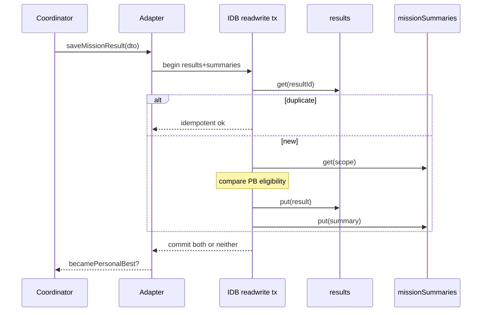
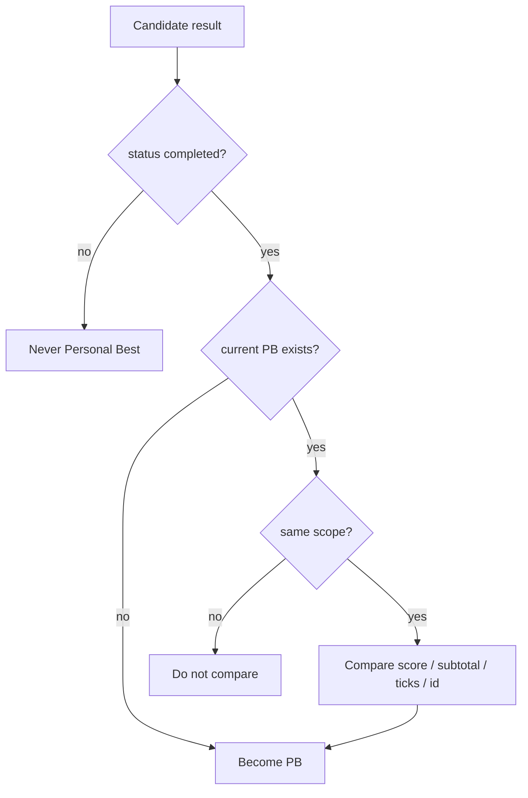
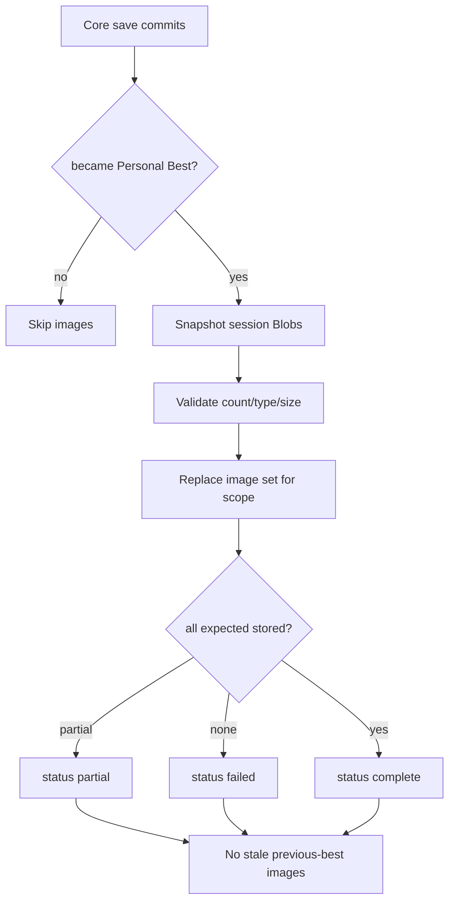
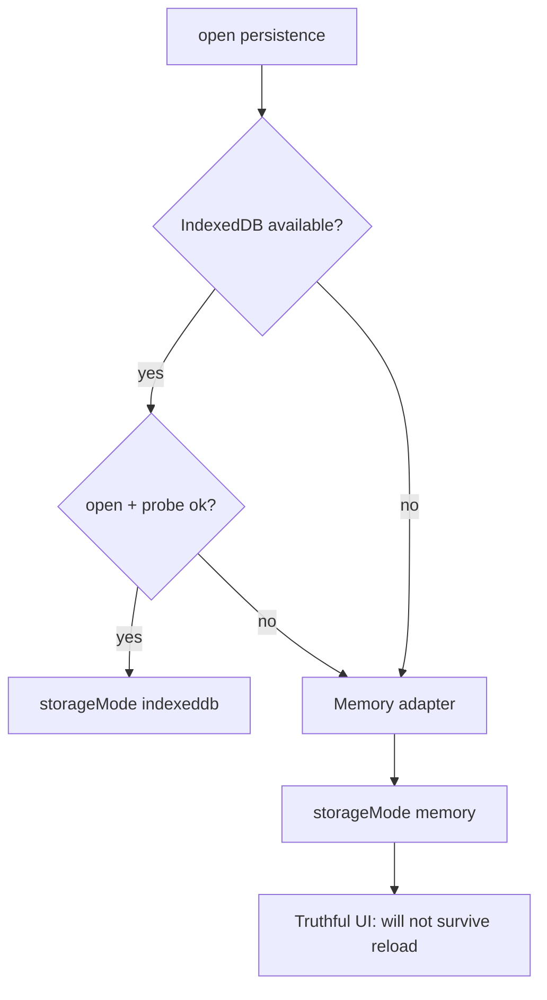

# Checkpoint 6 — Durable Mission Persistence

## 1. Verified post-PR-11 baseline

Squash-merged Checkpoint 5 into `main`:

- PR #11: `feat(v1.3.0): complete Coastal Ruins photography mission loop`
- Squash commit: `8dd934d0c74a82c0bcf1883280813763ab8a22dd`
- Reviewed head before squash: `acac032a71133d2fa1d60dc08aeeb7b7ec121b9a`
- Validation at merge: Node `22.22.3`, engineering `650` passed, application CI `770` passed, production build successful

Preserved from Checkpoint 5:

- Evidence Schema `2.0.0`
- Subject-bounds framing (`projectSubjectBounds`)
- Visibility sample LOS
- Capture IDs with session generation
- Yaw Axis Fix / controller calibration v2
- No second flight loop / RAF / Rapier world

## 2. Database name and version

```text
Database name: fpv-missions-v1
Database version: 1
```

Local-only IndexedDB. Not shared with `fpv-drone-builder-v1`, replay localStorage, or settings.

## 3. Pure persistence package

`@fpv/mission-persistence` (`packages/mission-persistence/`) is pure TypeScript.

Allowed: `@fpv/mission-domain`, `@fpv/photography-domain`, `@fpv/simulation-contracts` (indirect via types only as needed).

Forbidden: Angular, IndexedDB, Three.js, Rapier, Blob, object URLs, DOM, `src/app`.

## 4. Persisted DTOs

- `PersistedMissionResultRecord`
- `PersistedMissionObjectiveRecord`
- `PersistedMissionSummaryRecord`
- `PersistedBestImageManifestEntry` (metadata only; binary stays in adapters)
- `MISSION_PERSISTENCE_SCHEMA_VERSION = '1.0.0'`

## 5. Mission scope key

```text
<mission-id>@<mission-version>#<scoring-policy-version>
```

Example: `coastal-ruins-survey@1.0.0#1.0.0`

Different mission or scoring-policy versions never compete for Personal Best.

## 6. Stores and indexes

| Store | Key | Indexes |
|---|---|---|
| `results` | `resultId` | `missionScopeKey`, `savedAtEpochMs`, compound `missionScopeKey_savedAt` |
| `missionSummaries` | `missionScopeKey` | — |
| `bestImages` | `<scope>:<objectiveId>` | `missionScopeKey`, `personalBestResultId` |

`bestImages` stores an ArrayBuffer binary payload in the application adapter (converted to Blob only when creating presentation object URLs). Binary data never enters `@fpv/mission-persistence`.
| `metadata` | `key` | — |

## 7. Atomic core save transaction



Image Blobs are **not** written inside this transaction.

## 8. Personal Best comparator

Only `status === 'completed'` is eligible.

Order:

1. higher `totalScore`
2. higher `requiredObjectiveSubtotal`
3. lower `elapsedTicks`
4. lexicographically smaller `resultId`

`savedAt` is ignored. Failed results update history/attempt stats only.



## 9. Retention

- Keep latest **20** results per scope (`MISSION_RESULTS_RETENTION_LIMIT`)
- Always pin current Personal Best
- History sort: `savedAtEpochMs` desc, then `resultId`
- Other scopes unaffected

## 10. Image persistence flow



## 11. Partial image failure

- Result and Personal Best remain valid
- Partial new records cleaned / replaced set is authoritative
- Status becomes `partial` or `failed`
- Diagnostic: `MISSION_BEST_IMAGES_PERSIST_FAILED`
- Stale old images are never shown for the new best

## 12. Memory fallback



When an IndexedDB transaction fails after open, the write reports failure diagnostics (`WRITE_FAILED` / `TRANSACTION_ABORTED` / `QUOTA_EXCEEDED`). The coordinator does not silently claim a durable save. Permanent open failure switches to memory for subsequent lifetime of the page.

## 13. Corruption handling

Every record is validated on read.

Invalid records are **ignored** on read (`disposition: 'ignore'`). They never become Personal Best. Retention/clear paths may delete excess or scoped data; corrupt rows encountered during listing increment `invalidCount`.

Diagnostics include open/write/read/record-invalid/transaction-aborted/quota/fallback/images/clear codes.

## 14. Quota handling

Quota errors surface as `MISSION_PERSISTENCE_QUOTA_EXCEEDED`. Oversized images (> 8 MiB) are rejected without invalidating the result. Image quota failure never rolls back the core result/summary transaction.

## 15. Results UI

Shows: saving / saved / New Personal Best / saved without images / memory-only / attempt saved / save failed.

**New Personal Best** appears only after persistence confirms comparator outcome.

Retry and Return to Expeditions remain available while save is in flight; stale callbacks are rejected.

## 16. Expeditions progress

Coastal Ruins Survey shows:

- completed flag
- Personal Best score
- latest score
- completion count
- last played date
- image availability status
- memory-only warning
- latest five results (twenty retained internally)

No online leaderboard / social / cloud sync.

## 17. Clear mission data

Explicit confirmation required.

Clears only:

- mission results, summaries, PB pointers, PB images
- mission object URLs / in-memory fallback records

Does **not** clear replay, aircraft builds, controller calibration, settings, or drone-builder IndexedDB.

Does **not** fix the pre-existing replay clear-data key mismatch in this checkpoint.

## 18. URL lifecycle

- Session presentation: object URLs owned by `MissionResultsFacade`
- Persistence snapshots Blob references before retry/exit revoke
- History facade creates URLs for stored PB images and revokes on refresh/release
- Replacing an image revokes the previous URL
- No fetching object URLs back into Blobs

## 19. Retry / exit concurrency

`MissionPersistenceCoordinator.invalidatePending()` bumps a generation counter so in-flight saves cannot update UI after retry/exit. Duplicate result IDs are not rewritten.

## 20. Tests

- Pure package: scope key, DTO validation, serialization, comparator, retention, summary
- IndexedDB (`fake-indexeddb`): stores, atomic save, duplicates, PB, failed history, scope isolation, retention, images, clear, corrupt reads
- Memory fallback adapter
- Coordinator: one-save, stale rejection, memory mode
- UI: results persistence statuses, Expeditions progress, clear confirmation
- Dependency boundaries: pure package free of IDB/Blob/Angular; mission services free of IDB

## 21. Preserved behavior

Unchanged: Evidence Schema `2.0.0`, scoring, capture timing, subject projection, flight physics, fixed-step seam, controller/yaw, camera, LOS, collision rollback, retry, replay, ghost, chase.

Persistence consumes immutable completed results and never re-scores them.

## 22. Checkpoint 7 scope (deferred)

Not started. Expected later work may include richer history UX, cross-tab reactive sync, and additional mission packages — without changing scoring authorities.

## 23. Remaining risks

- Presentation image race: last-objective Blob may arrive after the first save snapshot → `saved-without-images` (result still valid)
- Full cross-tab live sync deferred; transactional validity is required now
- Pre-existing replay clear-data key mismatch remains deferred
- Session IDs remain wall-clock based (Checkpoint 5 caveat); result IDs are still unique per attempt

## Guarantees

- IndexedDB is local-only
- Failed results never become Personal Best
- Images are presentation-only and never affect score / comparator / completion
- Storage never influences scoring
- Persistence failure does not invalidate gameplay results
